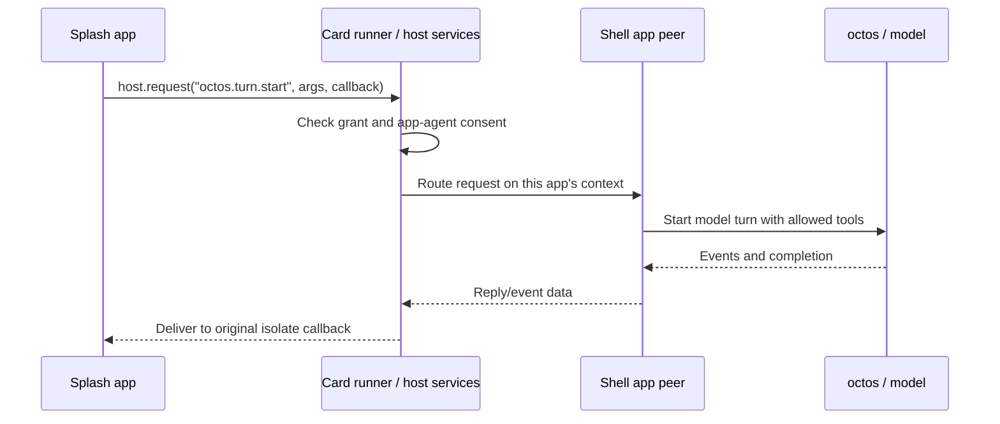

# Walk an app from this repository into OctoSense

For a junior Rust developer, begin with the executable path: this repository
is primarily a Python development harness, not the app's Rust runtime or
the octos agent kernel. This review follows Design Flow `caa5d364` and App
Hub `41bc959` on 2026-10-01. GUI, build, model-provider and device commands
below are **unverified in this review** unless specifically recorded as run.

## 1. Three kinds of source, two kinds of agent

| Name | Meaning and code owner |
| --- | --- |
| Native Rust app | A compiled `AppModule` hosted standalone or inside the OctoSense shell |
| `main.splash` | A script program evaluated by Makepad Script in a Splash isolate; the template here uses it |
| `page.card` / L0 | Declarative card source parsed/realized by Octoscript and lowered by Octoscript-Makepad into Makepad UI |
| `tools/octo` | This repository's Python command wrapping App Hub's `hub` and `card-host` |
| octos | Rust agent kernel managed by OctoSense; unrelated to the spelling of this CLI |
| Coding agent | An optional development assistant following this repository's `AGENTS.md` |
| App agent | A runtime peer that the device's shell prepares for an allowed app |

Splash script and Octoscript L0 reach the same UI host by different parsing
paths. A native Rust app may embed script UI while keeping its operations
in compiled Rust. Neither an app bundle nor this CLI automatically starts
an AI agent. The shell supplies the model provider, permissions, peer and
conversation routes.

Repository `AGENTS.md` is for development. A bundle's singular `AGENT.md`
is declared runtime agent material. App Hub validates the latter, but the
current shell does not install its instructions or skills into the peer.

## 2. Read these files in order

1. [`tools/octo`](../tools/octo): CLI dispatch, binary discovery, app
   creation, process launch, screenshots and admission checks.
2. [`templates/script-app/bundle/main.splash`](../templates/script-app/bundle/main.splash)
   and [`manifest.json`](../templates/script-app/bundle/manifest.json):
   the actual small notes app and its requested permissions.
3. [`SCRIPT-API.md`](SCRIPT-API.md): the callable script API and lifetime
   rules, including `ui` availability and callbacks.
4. [`flows/script-app/FLOW.md`](../flows/script-app/FLOW.md): how to turn
   a brief into a tested app without making up host APIs.
5. [`flows/image-to-card/flow.py`](../flows/image-to-card/flow.py): the
   separate orchestration path for visual/card projects.
6. [`flows/core/native_runtime.py`](../flows/core/native_runtime.py):
   how runtime source versions are prepared and checked.

Then follow the runtime in
[App Hub's code walkthrough](https://github.com/OctoSense-org/OctoSense-App-Hub/blob/main/docs/CODE-WALKTHROUGH.md)
and the complete shell/peer path in
[OctoSense](https://github.com/OctoSense-org/OctoSense/blob/main/docs/architecture-walkthrough.md).

## 3. Trace `tools/octo new`, `run`, `shot`, `check`

`hub_repo` selects `OCTOSENSE_APP_HUB`, or the sibling App Hub checkout.
`find_binary` checks explicit `OCTO_HUB`/`OCTO_CARD_HOST`, candidate release
directories and `PATH`. It checks the `hub help` banner when searching so
GitHub's unrelated `hub` executable is not mistaken for App Hub. Explicit
binary overrides are the caller's responsibility.

`cmd_new` validates the app id, rejects `os.*` without `--system`, copies
the template and contributor instructions, and edits name/version/id in
the new manifest. It stamps when `hub` is available. A directory containing
the template is not yet a publishable app: listing placeholders and artwork
still need the author's work.

`cmd_run` requires a manifest and a free remote port. It constructs:

```text
card-host --bundle <absolute bundle> --app-data <state directory>
          --allow-unsigned --stamp
```

`--no-stamp` omits the write; `--system` requests system-app admission.
The default state directory is `<bundle-parent>/.local-state`.
`MAKEPAD_REMOTE` selects the bridge port; `--hidden` sets
`MAKEPAD_HIDE_WINDOWS=1` and removes a focus override.

There are two process modes, which matter in scripts:

- Without `--detach`, Python waits for `card-host` to exit. A visible or
  hidden app keeps this terminal occupied.
- With `--detach`, it writes `card-host.log`, waits for admission and the
  expected process's bridge, verifies `/s` returns the new process id,
  waits for app widgets in `/snap` and a rendered frame, then returns.
  Startup failure terminates only the process it started.

`cmd_shot` uses the bridge's `/g?raw=1`, verifies PNG bytes, waits for app
widgets and attempts to capture two identical frames. An animation can
exhaust the settling interval; the tool reports that and keeps the last
frame. A file existing is not a visual review: open the capture.

`cmd_check` calls the real `hub stamp` for unsigned bundles and then
`hub check`, forwarding extra gate flags and returning its exit status.
For a signed manifest it skips restamping. It also prints wrapper status
and listing-placeholder notes, so the **gate output is forwarded**, not
necessarily the CLI's only output. The gate itself lives in App Hub, never
in this Python command.

## 4. Run a contained script app

Follow [QUICKSTART](QUICKSTART.md) for cloning/prerequisites. Use a prepared
workspace with this repository, App Hub, `makepad`, `octoscript-makepad`
and `octoscript` as siblings. From Design Flow:

```sh
python3 tools/setup-native.py
python3 tools/setup-native.py --check
```

From the App Hub sibling:

```sh
cargo build --release -p octosense-card-host -p octosense-app-hub
```

Back in Design Flow:

```sh
tools/octo doctor
tools/octo new /tmp/octosense-walkthrough-notes --id walkthrough.notes --name "Walkthrough Notes"
tools/octo run /tmp/octosense-walkthrough-notes/bundle --hidden --detach --port 8141
curl -s http://127.0.0.1:8141/snap
tools/octo shot 8141 /tmp/octosense-walkthrough-notes/first-frame.png
curl -s http://127.0.0.1:8141/quit
```

Use a new destination if that directory already exists, and a different
port if occupied. This captures evidence outside the submission bundle.
For publication, first complete the listing and capture its named
screenshots, then run:

```sh
tools/octo check /tmp/octosense-walkthrough-notes/bundle
```

The untouched template may fail the complete submission gate; the
walkthrough does not claim it is publication-ready. `run` modifies the
manifest by default and `card-host` cannot verify signed manifests. Use a
development copy, and use the store path for signing/install tests.

The same host accepts an L0 `page.card` bundle with its data and kit. The
runtime first looks for the script entry; otherwise it prepares/lowers the
card. This is not `cargo run` on a native app crate. To run a native Rust
app, desktop shell, Android Home app or ROM, use the commands in
[OctoSense's README](https://github.com/OctoSense-org/OctoSense/blob/main/README.md).
The ROM packages the shell with the operating system; creating a bundle
here does not build or flash it.

## 5. Understand what the standalone run proves

`card-host` applies the manifest policy before evaluating the UI. That
checks the contained app path: script/card parsing, rendering, jail storage,
network allowlist and declared capabilities. It has the host-request
transport but **registers no services**. `mail.*`, `model.complete`,
`octos.*` and `glance.*` therefore cannot be tested end to end there.

The shell uses App Hub's `CardModule`, plus its own registered Rust services.
A script call follows this route:



The exact request/event schemas and graceful unavailable example are in
[AI-SERVICES](AI-SERVICES.md). A one-shot `model.complete` uses a separate
service and does not imply a peer conversation. `llm` manages provider
configuration for system apps; it is not a general prompt API.

To test your app in the desktop shell before public submission, follow
[the local signed-catalog rehearsal](PUBLISHING.md#4-rehearse-the-store-path-locally).
The standalone store installs but does not launch a shell app. A phone's
stock Home build does not gain a development catalog just because you set
environment variables in your Mac terminal; see
[the phone limitations](QUICKSTART.md#9-run-it-on-an-octosense-phone).

## 6. How an app agent reaches data, people and other agents

A runtime app agent is a model conversation restricted to one app/account.
The shell asks the person to allow it, prepares its peer, installs available
tool declarations and opens conversation contexts. On desktop, **Ask
&lt;app&gt;** is a host-owned human chat surface. App-owned `octos.*` screens
and supported L0 `sys.chat` cards are other entry points. The general phone
per-app panel entry is not present at the reviewed shell snapshot.

The system assistant can discover allowed, prepared peers and send work
using their **peer slug**, then gather their replies. Human and system
requests use distinct contexts on the app's peer. A reply goes to the
requesting context; being on the same peer does not merge both transcripts.

The shell normally gives an app agent bounded read tools over
`accounts/device/` for a single-account app, or the active account folder.
`storage.agent_workspace` controls whether such a workspace is exposed.
This does not mean the agent understands every file format or can read
arbitrary paths. If the UI saves a record at the jail root, it is not
automatically inside the agent's account workspace. Store data there
deliberately or expose a supported tool. Host-service credentials and
`.host` state remain outside the app's jail.

An app's `tools.json` describes APIs for model callers. It is not executable
script registration. At this snapshot, first-party host-service handlers
can execute tools; a store app's `implemented_by: "app"` tool has no shell
dispatcher. `AGENT.md`, skills, background triggers and model `needs`
likewise have more contract support than runtime wiring. Do not build an
app whose essential behavior depends on these missing paths.

Cross-app tool use needs an owner's shareable declaration, the caller's
grant, host admission and an executable route. Destructive/outward calls
also have supervision policy. A field requesting `mail.send` is not enough:
App Hub's default `HostLimits::offered_tools` does not contain arbitrary
other-app names. The only plain kernel tool allowed in a contained agent's
`agent.tools` is `ask_user_question`; peer and unrestricted file/shell tools
are not inherited from the system assistant. System-to-app delegation is
implemented; arbitrary app-to-system delegation is not an implied grant.

## 7. Where Tokio fits

This repository's CLI starts operating-system child processes and polls an
HTTP bridge. It does not schedule Tokio tasks. App Hub runs UI events,
request/reply queues and worker threads. The shell-managed octos runtime has asynchronous sessions/turns and peer
routing. Desktop normally launches a separate kernel process; the broker
and kernel-service runtimes live in the shell. A peer identity,
conversation context, running future and worker thread are different
objects: one app peer can serve separate contexts over time; it is not one
permanent thread or one task per widget.

For the exact `tokio::spawn`, channels, cancellation and UI handoff, continue
in OctoSense's `crates/ai-host`, `crates/app-peers` and the octos dependency
at the shell's pin. The end-to-end
[shell walkthrough](https://github.com/OctoSense-org/OctoSense/blob/main/docs/architecture-walkthrough.md)
connects those objects to Rust code.

## 8. The image/card design path is a separate pipeline

[`tools/image-to-appcard-flow.sh`](../tools/image-to-appcard-flow.sh) invokes
[`flows/image-to-card/flow.py`](../flows/image-to-card/flow.py).
`read_manifest` validates the project schema, scene ids, relative paths,
406×776 artboard, 8–12 scenes, and `en`/`cn` locales. `local` prevents paths
escaping the project. `fingerprint` hashes the manifest and input artifacts
so evidence can be tied to source bytes.

`STAGES` names intake, prepare, observe, measure, map, semantic, compile,
capture, gate, extract, bundle, service-test, wasm, integrate, web-test and
hosted-test. `commands_for` builds stage commands; configured checks use
argument arrays, not shell command strings. `run` records execution
evidence. The default stage subset is not proof that all visual, service,
browser and hosted checks ran. `plan` describes work; it does not perform
the checks it prints.

Shared policy/review/repair logic is in
[`flows/core`](../flows/core/README.md). The script-app flow does not require
an image pipeline. A browser preview validates its own route, not native
rendering or shell services. Follow the chosen flow's evidence and human
checkpoints when actually authoring or publishing; a repository code review
does not need to invent app screenshots or submit a bundle.

## 9. Pins, checks and useful failure boundaries

[`native-runtime.lock.json`](../native-runtime.lock.json) selects
Octoscript-Makepad `cb66de073469063abeb2a5ab2a2bbf3cdb365745`.
Its `runtime.json` then owns the underlying Makepad and Octoscript revisions.
`setup-native.py` delegates to the runtime preparation/verification code;
`--check` inspects rather than updates the prepared set. It is possible for
OctoSense main to support `sys.chat` while this older authoring pin cannot.
Do not erase that difference by casually changing a shared sibling checkout.

Lightweight checks for a documentation/CLI review:

```sh
python3 tools/check-links.py
python3 tools/octo --help
python3 tools/octo run --help
python3 -m unittest discover -s flows/tests -p 'test_octo_run.py'
```

The link checker checks tracked Markdown and skips historical evidence;
it does not fetch external URLs or verify anchors. Check newly added files
as well. `doctor` proves executable discovery, not a GPU launch or a model
conversation. Runtime setup checks prove source pins, not a device build.

| Failure | Investigate |
| --- | --- |
| `hub` not found | Explicit binary paths, release build and sibling layout |
| Busy port | Existing process identity; choose another port, do not kill unrelated apps |
| Admitted but no app widgets | `card-host.log`, `/snap`, script/lowering diagnostics |
| `no service answers` | Wrong host for the test or absent shell registration |
| Gate accepts agent metadata, runtime feature absent | AI status table and actual shell executor/setup code |
| Agent misses a saved note | Account workspace versus UI storage location |
| New shell card syntax fails in authoring | Consumer runtime pins before changing app source |

Preserve dated historical verification in existing docs. For new claims,
report the exact command and result, and distinguish source inspection,
mocked/unit checks, real native execution, provider-backed AI and device
testing.

Review verification (2026-10-01): `tools/check-links.py` reported 0 broken /
0 pending; the changed-file link check also passed; both CLI help commands
passed; `test_octo_run.py` passed all 6 tests using fake processes/HTTP
bridges. `tools/octo doctor` reported missing `hub` and `card-host` binaries
in this isolated review workspace. `tools/setup-native.py --check` refused
the unprepared locked runtime. No shared runtime checkout was changed to
make those checks pass; native builds and launches remain unverified.
