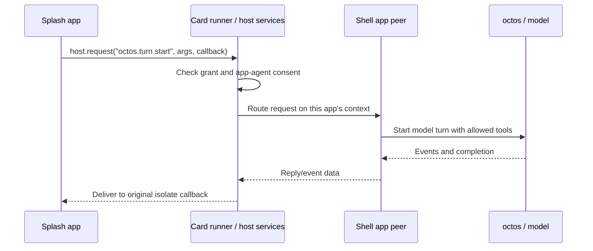

# Walk an app from this repository into OctoSense

This repository is a Python development harness. The Rust hosts live in
App Hub; OctoSense supplies the shell and manages the octos agent kernel.
Start with the CLI, then follow the bundle into its runtime. Runtime versions
come from [`native-runtime.lock.json`](../native-runtime.lock.json) and the
selected framework's `runtime.json`.

## 1. Names and responsibilities

| Name | Meaning and code owner |
| --- | --- |
| Native Rust app | A compiled `AppModule` hosted standalone or inside the OctoSense shell |
| `main.splash` | A script program evaluated by Makepad Script in a Splash isolate; the template here uses it |
| `page.card` / L0 | Declarative card source parsed/realized by OctoScript and lowered by OctoScript-Makepad into Makepad UI |
| `tools/octo` | This repository's Python command wrapping App Hub's `hub` and `card-host` |
| octos | Rust agent kernel managed by OctoSense; separate from `tools/octo` |
| Coding agent | An optional development assistant following this repository's `AGENTS.md` |
| App agent | A model conversation with app-scoped tools; the shell gives it a peer identity for routing |

Splash script and OctoScript L0 reach the same UI host by different parsing
paths. A native Rust app may embed script UI while keeping its operations
in compiled Rust. The shell supplies the model provider, permissions, peer
and conversation routes for an app agent.

Repository `AGENTS.md` is for development. A bundle's `AGENT.md` holds the
app agent's instructions; the manifest declares it. App Hub validates it, and
the OctoSense shells load it and the bundle's skills as guidance for each turn
of the app's agent.

## 2. Read these files in order

1. [`tools/octo`](../tools/octo): CLI dispatch, binary discovery, app
   creation, process launch, screenshots and admission checks.
2. [`templates/script-app/bundle/main.splash`](../templates/script-app/bundle/main.splash)
   and [`manifest.json`](../templates/script-app/bundle/manifest.json):
   the actual small notes app and its requested permissions.
3. [`SCRIPT-API.md`](SCRIPT-API.md): the callable script API and lifetime
   rules, including `ui` availability and callbacks.
4. [`flows/script-app/FLOW.md`](../flows/script-app/FLOW.md): how to turn
   a brief into a tested app without making up host APIs.
5. [`flows/image-to-card/flow.py`](../flows/image-to-card/flow.py): the
   separate orchestration path for visual/card projects.
6. [`flows/core/native_runtime.py`](../flows/core/native_runtime.py):
   how runtime source versions are prepared and checked.

Then follow the runtime in
[App Hub's code walkthrough](https://github.com/OctoSense-org/OctoSense-App-Hub/blob/19bb52d402e80e89e085dea989615e3ec612d359/docs/CODE-WALKTHROUGH.md)
and the complete shell/peer path in
[OctoSense](https://github.com/OctoSense-org/OctoSense/blob/61c668279a7c38a0f8056134d8d29e42ed715806/docs/architecture-walkthrough.md).

## 3. Trace `tools/octo new`, `run`, `shot`, `check`

`hub_repo` selects `OCTOSENSE_APP_HUB`, or the sibling App Hub checkout.
`find_binary` checks explicit `OCTO_HUB`/`OCTO_CARD_HOST`, then the candidate
release directories, then `PATH`. On Windows it tries `hub.exe` and
`card-host.exe` before the bare names in each directory. It checks the
`hub help` banner when searching so GitHub's unrelated `hub` executable is
not mistaken for App Hub. Explicit binary overrides are the caller's
responsibility.

`cmd_new` validates the app id before it creates anything. It refuses an id
that is, or ends in, a name in `RESERVED_NAMES` (kept in step with App Hub's
contract, which stays the authority), and an `os.*` id without `--system`.
Its argument parser requires at least one `--platform`. `cmd_new` then
copies the template, contributor instructions and publishing workflow, writes the id, name and
version into the manifest and the deduplicated platforms into the listing,
and stamps when `hub` is available. The platforms are a claim to test, not
evidence. Complete the listing, artwork and screenshots before submitting
the generated app.

`cmd_run` requires a manifest and a free remote port. It constructs:

```text
card-host --bundle <absolute bundle> --app-data <state directory>
          --allow-unsigned --stamp
```

`--no-stamp` omits the write; `--system` requests system-app admission.
The default state directory is `<bundle-parent>/.local-state`.
`MAKEPAD_REMOTE` selects the bridge port; `--hidden` sets
`MAKEPAD_HIDE_WINDOWS=1` and removes a focus override.

There are two process modes, which matter in scripts:

- Without `--detach`, Python waits for `card-host` to exit. A visible or
  hidden app keeps this terminal occupied.
- With `--detach`, it writes `card-host.log`, waits for admission and the
  expected process's bridge, verifies `/s` returns the new process id,
  waits for app widgets in `/snap` and a rendered frame, then returns.
  Startup failure terminates only the process it started.

`cmd_shot` uses the bridge's `/g?raw=1`, verifies PNG bytes, waits for app
widgets and attempts to capture two identical frames. An animation can
exhaust the settling interval; the tool reports that and keeps the last
frame. Open the PNG and look at it.

`cmd_check` calls `hub stamp` for unsigned bundles. If stamping fails, it
prints that command's output, returns its failure status and skips the gate.
Otherwise it runs `hub check`, forwards extra gate flags and returns the
gate's exit status. A manifest with a legacy signature or `integrity.github`
skips stamping. The command also
prints progress lines and listing-placeholder notes. App Hub owns admission
policy; this Python command handles the development sequence.

Because `check` restamps editable source first, a pass does not prove that its
committed digest is current. Check before each source commit. The GitHub release
pack is sealed separately; a source check does not verify that publisher proof.

### Trace `tools/octo publish-github`

`cmd_publish_github` requires an editable app directory with `bundle/manifest.json`.
`publisher_workflow` reads `tools/publisher-toolchain.json` and requires an exact
reviewed App Hub commit; no pin means refusal, not a fallback to moving `main`.
`install_publisher_workflow` writes `.github/workflows/publish-app.yml` atomically,
refuses symlink paths and requires `--replace` for different existing content.
`cmd_new` uses the same installer. Neither command pushes or submits anything.

The template in `tools/publish-app.template.yml` runs on a new `v*` tag in a
public GitHub repository. Its prepare job builds the pinned native `hub` and
runs `publisher-prepare` to check/bind source and emit the canonical manifest
outside `bundle/`. The publishing job uses `actions/attest`, attaches the proof,
then runs `publisher-verify` and `publisher-pack` without restamping. Its release
contains the sealed pack, canonical manifest and release receipt. The developer
supplies no private signing key; GitHub supplies the job/OIDC identity.

`publisher-github-v1` needs contract 1.8.0 and a compatible Store verifier.
Real GitHub proof and native Store install/update checks passed with an isolated
test catalog ([evidence](PUBLISHING.md#36-publisher-key--human)); shipped-shell
and phone installation remain unverified, and a compatible release is pending.
Opening an App Hub issue expresses publication intent and can happen first;
the workflow provides verifiable bytes for that issue. Hub checks, administrator
approval and authenticated catalog publication remain separate steps.

## 4. Run a contained script app

Follow [QUICKSTART](QUICKSTART.md) for cloning and prerequisites. Use a
prepared workspace with this repository, App Hub, `makepad`,
`octoscript-makepad` and `octoscript` as siblings. The setup and build steps
are QUICKSTART's (not run). From Design Flow:

```sh
python3 tools/setup-native.py
python3 tools/setup-native.py --check
```

From the App Hub sibling:

```sh
cargo build --release -p octosense-card-host -p octosense-app-hub
```

If the build fails with `no variant … TextInputStateQuery`, see [The `card-host` build fails on `TextInputStateQuery`](QUICKSTART.md#the-card-host-build-fails-on-textinputstatequery).

Back in Design Flow:

```sh
tools/octo doctor
tools/octo new ~/apps/walkthrough --platform macos --id dev.example.walkthrough --name "Walkthrough Notes"
tools/octo run ~/apps/walkthrough/bundle --hidden --detach --port 8141
curl -s http://127.0.0.1:8141/snap
tools/octo shot 8141 ~/apps/walkthrough/first-frame.png
curl -s http://127.0.0.1:8141/quit
```

`run` prints the admission line, then `ready: first frame drawn`:

```text
card-host: dev.example.walkthrough 0.1.0 admitted — capabilities {"storage"}, hosts {}, storage 16777216 bytes, agent none
ready: first frame drawn
```

`shot` prints `wrote …/first-frame.png (824x1784, … bytes)`; the PNG is
evidence, kept outside the submission bundle. If `~/apps/walkthrough`
exists, give `tools/octo new` another path; if port 8141 is busy, pass
another `--port`.

Keep the app id's last segment off the reserved list. `tools/octo new`
refuses `walkthrough.notes` before it creates any file:
`octo: id 'walkthrough.notes' uses reserved native/host namespace 'notes'; choose an app-specific name`.
If you change the id in the manifest later, `card-host` refuses the bundle:
`app id "walkthrough.notes" ends in "notes", which is reserved`.

For publication, first complete the listing and capture its named
screenshots, then run:

```sh
tools/octo check ~/apps/walkthrough/bundle
```

`run` stamps the manifest by default. Test with `card-host` on an unsigned
copy; the optional legacy signing/install compatibility path is
[the store rehearsal](PUBLISHING.md#4-rehearse-the-store-path-locally).

The same host accepts an L0 `page.card` bundle with its data and kit. The
runtime first looks for the script entry; otherwise it prepares/lowers the
card. Native Rust apps use their own Cargo targets. For a native app,
desktop shell, Android Home app or ROM, use the commands in
[OctoSense's README](https://github.com/OctoSense-org/OctoSense/blob/main/README.md).
The ROM packages the shell with the operating system and has a separate
build and flash workflow.

## 5. Understand what the standalone run proves

`card-host` applies the manifest policy before evaluating the UI. That
checks the contained app path: script/card parsing, rendering, jail storage,
network allowlist and declared capabilities. It has the host-request
transport but **registers no services**, so no host service (`mail.*`,
`auth.*`, `gmail.*`, `model.complete`, `octos.*`, `glance.*`) can be tested
end to end there. Every call answers
`no service answers "<family>" on this device`, except `runtime.list` and
`runtime.describe`: App Hub's dispatcher answers the `runtime` family itself
(`crates/appstore/src/services.rs`).

The shell uses App Hub's `CardModule`, plus its own registered Rust services.
A script call follows this route:



The exact request/event schemas and graceful unavailable example are in
[AI-SERVICES](AI-SERVICES.md). A one-shot `model.complete` uses a separate
service for a single model request. `llm` manages provider configuration
for system apps.

To test your app in the desktop shell before public submission, follow
[the optional legacy signed-catalog rehearsal](PUBLISHING.md#4-rehearse-the-store-path-locally).
The standalone store installs bundles; the full shell launches their app
clients. Phone catalog configuration belongs to the Home build; see
[the phone limitations](QUICKSTART.md#9-run-it-on-an-octosense-phone).

## 6. How an app agent reaches data, people and other agents

A runtime app agent is a model conversation restricted to one app/account.
The shell asks the person to allow it, prepares its peer, installs available
tool declarations and opens conversation contexts. On desktop, `Ask <app>`
is a host-owned chat surface for the person. App-owned `octos.*` screens are another
entry point. L0 `sys.chat` cards on the Glance screen also provide chat. The
[shell walkthrough](https://github.com/OctoSense-org/OctoSense/blob/61c668279a7c38a0f8056134d8d29e42ed715806/docs/architecture-walkthrough.md#6-where-a-person-talks-and-where-the-answer-goes)
explains their routing.

### Follow “Summarize my saved notes”

Assume the app has saved notes in its account folder and the person has
allowed its agent. This example illustrates the shell route; the standalone
run in §4 cannot exercise it.

1. **Choose the recipient.** A **peer** is an agent identity used for routing.
   Its **peer slug** is the name the kernel assigns that identity. The shell
   routes a person's `Ask <app>` request to that app's prepared peer. The
   system agent discovers allowed peers and uses the actual slug when
   delegating the same request; an app id is not a substitute for that slug.
2. **Choose the conversation.** A **session** owns a conversation transcript
   and its model turns. The person's requests use a separate **sharing-context
   session**: a conversation attached to the peer that can receive bounded
   recent history from its other conversation. The system request uses the
   app peer's own session. The two keep their own transcripts, while the
   shell panel can display both.
3. **Read the notes.** The model requests an available file-read tool; the
   shell limits it to the exposed account workspace described below. The
   tool's result becomes input for the model's summary. Notes elsewhere
   require a supported tool that can read them.
4. **Return the answer.** The person's session sends events and completion
   to its **event sink**, the receiver that forwards updates to the person's
   conversation. A system-delegated answer reaches the **peer blackboard**,
   the kernel's record of peer results that the system agent gathers.
   Sharing a peer identity does not send both answers to the same receiver.

An app-owned chat uses the `octos.*` route in §5 to start work and retrieve
its reply/event data. See [AI-SERVICES](AI-SERVICES.md) for that API; the
host callback and the model's completed answer are separate parts of the
exchange.

### Data and executable tools

On Unix, the shell gives an app agent bounded `files.list`, `files.read`
and `files.search` tools when the person has consented and an account
workspace is available.
They read `accounts/device/` for a single-account app, or the active account
folder. `storage.agent_workspace` controls whether that workspace is exposed.
Put records the agent should read in that account folder, or expose a
supported tool that interprets them. A record saved at the jail root stays
outside the account workspace. Host-service credentials and
`.host` state remain outside the app's jail.

An app's `tools.json` describes APIs for model callers. The shell runs a tool
with `implemented_by: "host-service"` on the host service its `host_method`
names, or else on the service of its namespace, when the app is granted that
family. A system app's own namespace counts as granted; a store app's
namespace grants nothing, so a store app's host-service tools run through a
`host_method` from App Hub's reviewed list. A tool with
`implemented_by: "app"` runs only on OctoSense `main`: `ScriptAppExecutor` in
`crates/shell/src/host_tools/script_apps.rs` submits it to App Hub's
`script_tools` queue, and the open full app's signed `app_tool` handler
answers it. `desktop-v0.1.0-beta.2` has no executor for it and refuses it.
`AGENT.md` and skills are loaded as guidance for each turn. `background` and
`triggers.events` are honored for two events: Mail's `mail.messages.new` and
the Gmail service's `<namespace>.new_message`. Not yet: schedules, and model
choice from `needs`. Use implemented services for essential app behavior.

The system bundles demonstrate this split: News has read and notification
tools; Mail has read, draft and card tools; Calendar has event and card
tools. Photos, Maps, Camera and YouTube declare their own
`<namespace>.notify`, executed by the shell's shared
[`glance_notice` service](https://github.com/OctoSense-org/OctoSense/blob/main/crates/shell/src/glance_notice.rs).
These declarations add an agent and a notice route, not general access to
camera controls or photo records. AI providers declares no agent. The shell's
[`script_apps` tests](https://github.com/OctoSense-org/OctoSense/blob/main/crates/shell/src/host_tools/script_apps.rs)
record these exact tool rosters.

Cross-app tool use needs an owner's shareable declaration, the caller's
grant, host admission and an executable route. Destructive and outward
calls also wait for the person's approval. App Hub admission checks the request against
`HostLimits::offered_tools`; its default list excludes arbitrary other-app
names such as `mail.send`. The only plain kernel tool allowed in a contained agent's
`agent.tools` is `ask_user_question`; peer and unrestricted file/shell tools
are not inherited from the system agent. System-to-app delegation is
implemented; an app's agent has no implicit right to delegate to the system
agent.

## 7. Where Tokio fits

This repository's CLI starts operating-system child processes and polls an
HTTP bridge. App Hub runs UI events, request/reply queues and worker threads.
The shell-managed octos runtime has asynchronous sessions/turns and peer
routing. Desktop normally launches a separate kernel process; the broker
and kernel-service runtimes live in the shell. One peer can hold several
conversation contexts over its lifetime. Tokio tasks execute the work for
those contexts; the peer identity persists between turns.

For the exact `tokio::spawn`, channels, cancellation and UI handoff, continue
in OctoSense's `crates/ai-host`, `crates/app-peers` and the octos dependency
at the shell's pin. The end-to-end
[shell walkthrough](https://github.com/OctoSense-org/OctoSense/blob/61c668279a7c38a0f8056134d8d29e42ed715806/docs/architecture-walkthrough.md)
connects those objects to Rust code.

## 8. The image/card design path is a separate pipeline

The script path starts with a text brief and produces `main.splash`.
The image/card path starts with an existing atlas of 8–12 screens and
produces native L0 card assets and service bindings. Choose this path when
the project starts from those visual designs.

### Trace the default stages through one project

Consider an eight-screen project with a supplied atlas, its exact prompt,
a valid flow manifest and reviewed mappings for each scene. The default
stages consume those inputs and produce these artifacts:

| Stage | Input → result | Code to follow |
| --- | --- | --- |
| `intake` | Atlas + prompt + scene crop rectangles → preserved inputs and normalized reference images in `pipeline-output/intake` | [`atlas.py`](../flows/image-to-card/atlas.py) |
| `semantic` | Each scene's reference, contract, mapping and service-action files → semantic preflight result | [`native.py`](../flows/image-to-card/native.py), `preflight` |
| `compile` | Reviewed scene mapping → `page.card`, `page.data.json` and native kit assets | [`native.py`](../flows/image-to-card/native.py), `compile_page` |
| `bundle` | Compiled scenes + declared artwork → exported card bundle in `wizard/card-bundle` | [`bundle.py`](../flows/image-to-card/bundle.py) |
| `service-test` | The manifest's explicit `checks.service-test` command arrays → logs and exit results | [`flow.py`](../flows/image-to-card/flow.py), `configured_commands` |

Those are default output paths; the manifest can override them. Before
`semantic`, scene directories must already contain `reference.png`,
`contract.json`, `mapped.json`, `semantic-map.json` and `service-actions.json`.
The default selection does not prepare or author those files, render a
capture, or grant visual approval. Use the preparation and review steps in
[the image/card flow](../flows/image-to-card/FLOW.md) first. The exported
card assets also still need the app hand-off below.

### Follow the dispatcher and extend the plan

[`tools/image-to-appcard-flow.sh`](../tools/image-to-appcard-flow.sh) forwards
to [`tools/beauty-pipeline.sh`](../tools/beauty-pipeline.sh) with
`--image-to-appcard-flow`; that dispatcher selects Python and invokes
[`flows/image-to-card/flow.py`](../flows/image-to-card/flow.py).
`read_manifest` validates the project schema, scene ids, relative paths,
406×776 artboard, 8–12 scenes, and `en`/`cn` locales. `local` prevents paths
escaping the project. `fingerprint` hashes the manifest and input artifacts
so evidence can be tied to source bytes.

The supporting paths have distinct inputs and outputs:

| Path | Responsibility |
| --- | --- |
| [`flows/script-app`](../flows/script-app/FLOW.md) | Text brief to a contained `main.splash` app |
| [`flows/image-to-card`](../flows/image-to-card/FLOW.md) | One atlas of 8–12 screens to native cards, service bindings and an optional WASM bundle |
| [`flows/image-lib`](../flows/image-lib/README.md) | Per-design observe/measure/map/compile/capture/gate loop and its recorded evidence |
| [`flows/kits/sketch`](../flows/kits/sketch/FLOW.md) | Licensed Sketch design assets to a reusable theme kit, consumed by app/card flows |
| [`flows/core`](../flows/core/README.md) | Shared policy, review packets, repair, composition and gates |
| [`tools/beauty-pipeline.sh`](../tools/beauty-pipeline.sh) | Dispatches the image-card flow, `--ux-image`, `--repair`, or the default Sketch `run_kit.py` path |

The default `--stages` is `intake,semantic,compile,bundle,service-test`,
traced above. `STAGES` also offers these steps for other inputs or delivery
surfaces:

| Additional stages | Purpose |
| --- | --- |
| `prepare`, `observe`, `measure`, `map` | Prepare scene directories and develop their measured mappings |
| `capture`, `gate` | Capture the native UI and evaluate its recorded evidence |
| `extract` | Export declared service surfaces as independently mountable native trees |
| `wasm`, `integrate` | Build the browser runtime bundle and sync it into the website |
| `web-test`, `hosted-test` | Run the manifest's explicit checks for those delivery routes |

Select the stages your project needs. A browser capture covers the browser
route; native and hosted stages cover their respective runtimes.

`commands_for` builds stage commands; configured checks use argument arrays.
`run` resolves the entire selected plan before mutation, then creates a run
receipt with input fingerprints and the stages left unrun. Each command
gets a log, exit status and log hash. The first nonzero command marks its
stage failed and stops subsequent execution. The `finally` block records
failure or interruption and the remaining stages in `run.json`. `plan`
prints commands; `run` executes them; `status` reads the recorded result.
Follow [the flow contract](../flows/README.md#every-flow-follows-the-same-contract)
when a step fails: report the command, exit code and log, then fix the cause.

### Finish the app hand-off

All app flows converge on the same delivery sequence in
[flows/README.md](../flows/README.md#every-flow-follows-the-same-contract):

1. Package the app, stamp it and run the initial unsigned gate. Before
   capture, the expected missing-screenshot refusal may remain.
2. Run the bundle in `card-host`, drive the real interactions and capture
   the screenshots named in the listing. **HUMAN:** review the screenshots.
3. Restamp and check the completed bundle; only the unsigned warning may
   remain. Complete the `hub scan` review packet in
   [PUBLISHING](PUBLISHING.md).
4. **HUMAN:** open the App Hub issue to request publication (it may happen
   earlier), with repo/version/commit, screenshots and permissions.
5. Install/review the GitHub publishing workflow, commit tested source and
   push a new matching version tag with the person's authorization. The
   workflow attests and verifies the release without a developer key. Add
   that exact pack and workflow result to the issue; Hub checks and
   administrator approval still precede catalog publication.

The image and kit flows also have human checkpoints for paid generation or
licensed assets and semantic/visual approval. Preserve the source inputs
and resulting evidence through these decisions.

## 9. Pins, checks and useful failure boundaries

[`native-runtime.lock.json`](../native-runtime.lock.json) selects an
OctoScript-Makepad release. That release's `runtime.json` owns the underlying
Makepad and OctoScript revisions.
`setup-native.py` delegates to the runtime preparation/verification code;
`--check` inspects rather than updates the prepared set. The authoring pin
and the OctoSense shells use the same OctoScript revision, so an L0 card with
`sys.chat`, `ChatEntry`, `model-copy` or `sys.digest` checks the same way in
both ([AI-written text and in-card chat](AI-SERVICES.md#ai-written-text-and-in-card-chat-model-copy-syschat)).
Compare both consumers' pins before updating their shared sibling checkouts.

Check the documentation links and CLI behavior with:

```sh
python3 tools/check-links.py
python3 tools/octo --help
python3 tools/octo run --help
python3 -m unittest discover -s flows/tests -p 'test_octo_run.py'
python3 -m unittest discover -s tools -p 'test_*.py'
```

The last command tests `new` and the binary search, including Windows `.exe`
discovery, and checks the connected examples' agent and tool contracts; CI
runs it on Windows, Linux and macOS. Its check that `RESERVED_NAMES` matches
App Hub's contract needs an App Hub checkout (`OCTOSENSE_APP_HUB` or the
sibling) and skips without one.

The link checker checks tracked Markdown and skips historical evidence;
it does not fetch external URLs or verify anchors. Check newly added files
as well. `doctor` proves executable discovery, not a GPU launch or a model
conversation. Runtime setup checks prove source pins, not a device build.

| Failure | Investigate |
| --- | --- |
| `hub` not found | Explicit binary paths, release build and sibling layout |
| Busy port | Existing process identity; choose another port, do not kill unrelated apps |
| Admitted but no app widgets | `card-host.log`, `/snap`, script/lowering diagnostics |
| `no service answers` | Wrong host for the test or absent shell registration |
| Gate accepts agent metadata, runtime feature absent | AI status table and actual shell executor/setup code |
| Agent misses a saved note | Account workspace versus UI storage location |
| New shell card syntax fails in authoring | Consumer runtime pins before changing app source |
