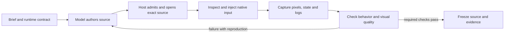

# Model-driven app development and validation

English | [简体中文](MODEL-VALIDATION.zh-CN.md)

A coding model can author an app, inspect its rendered UI, inject input and
repair failures when its host exposes those tools. Completion requires evidence
from the final source: a successful tool call or a model's summary is not enough.
Use this guide alongside the selected [flow](../flows/README.md), not as a
replacement for its admission, visual-review or publishing gates.

For Glance card work, the [app-card UX skill](../skills/octoscript-app-card-ux/SKILL.md)
adds a task journey and acceptance matrix for workspace expansion, shared editing
state, phone keyboard reachability and retained context. It reuses this model
validation loop rather than defining another provider or capture protocol.

## Choose the test surface

| Surface | What the model can drive | What the evidence does not establish |
| --- | --- | --- |
| Desktop Makepad instrument or `makepad_test` | An owned hidden native process; widget selectors, real input events, rendered screenshots, waits and assertions | Android keyboard, permissions, notifications or lifecycle behavior |
| OctoSense App Studio (in-app development tools, not Android Studio), Android test build | `studio.open`, `studio.input` (tap, text, scroll), `studio.inspect`, `studio.close` for the caller's contained app instance | Arbitrary other APKs, or a fully hidden phone session: this build opens a visible app |
| Android `studio.render` (test build) | An L0 card and fixtures rendered to a PNG at the device's Glance width while Home is in the foreground | Exported-card clicks, interactive instance state or shell publication |
| Android platform capture | With a separately implemented, authorized capture service, the display or a selected app or window | Makepad widget geometry, app-internal state or an offscreen runner for arbitrary APKs |

The desktop route uses Makepad's event dispatch and framebuffer capture rather
than Android UI automation. See the [native instrument runbook](../flows/core/NATIVE-INSTRUMENT.md)
and the [hidden-window and `makepad_test` examples](QUICKSTART.md#4a-headless-test-without-the-screen-several-apps-at-once).
Here, headless means a hidden native window with a working graphics session;
it does not claim a display-free renderer has been validated.

App Studio's Android inputs also go through Makepad, and `studio.inspect`
reads the app's render texture. The model can invoke these tools directly once
the host grants and registers them; no desktop operator has to perform each
tap. The reviewed phone build is OctoSense `ccf8013f`: its [tool declarations](https://github.com/OctoSense-org/OctoSense/blob/ccf8013f2bd7adbb6c20d5f52f47bcfbcbb55313/crates/shell/src/host_tools/studio.rs)
and [instance event and capture implementation](https://github.com/OctoSense-org/OctoSense/blob/ccf8013f2bd7adbb6c20d5f52f47bcfbcbb55313/crates/shell/src/studio/apps.rs)
define that scope. Not yet on OctoSense `main`: App Studio exists only in such
test builds. Released builds and this repository's runtime pin do not expose
these tools. Phone-hosted authoring also does not imply that model inference
runs locally.

A successful PNG capture alone does not prove that the model received the
image or understood it. The host must deliver the captured image itself in a
supported input format, not only a local filename or a tool receipt. Check
image delivery for each provider and model configuration:

1. Send the model a known screenshot.
2. Ask for a visible detail that the accompanying widget text does not
   contain.
3. If the model cannot name it, report visual review as unverified, and use an
   image-capable reviewer or a person while you repair the provider
   integration.

<a id="capturing-another-android-apk"></a>

### Capture another Android APK

Android supports cross-app capture without a PC or root through these
standard APIs. OctoSense still needs a host service and a model-facing tool
wired to the chosen API; the reviewed Studio tools do not provide that bridge.

- **MediaProjection:** the user authorizes a capture session. Android 14+
  also offers a selected-app capture mode. Follow the OS consent and foreground
  service requirements. [Android guide](https://developer.android.com/media/grow/media-projection)
- **AccessibilityService:** a user-enabled service with screenshot capability
  can capture the display on Android 11+, or an accessibility window on Android
  14+. Gesture dispatch is a separate capability; capture alone does not grant
  input control. [Android API](https://developer.android.com/reference/android/accessibilityservice/AccessibilityService)
- **Protected content:** `FLAG_SECURE` can block capture or leave protected
  content blank. Record the restriction, rather than treating it as a rendering
  failure or trying to bypass it. [Android guidance](https://developer.android.com/security/fraud-prevention/activities#FLAG_SECURE)

Label platform captures separately. A full Android screenshot can establish
keyboard overlap or notification presentation that an app-texture PNG excludes.
It cannot replace the app-owned capture required by a native-rendering gate.
Capturing another APK does not grant access to its private storage or create a
general hidden-APK test environment. Not yet: OctoSense implements none of
these routes, and none has been tested on a device.

## Run a complete review loop



1. **Define observable outcomes.** List screens, actions, item identities, data
   sources and whether state must survive restart. For card collections, list
   the Glance, expanded and full-app views. (The archived runs call them
   L0/L1/L2; these are not the card-language levels in the
   [glossary](GLOSSARY.md).) Mark fictional fixtures and unavailable media.
2. **Supply the actual runtime contract.** Give the model the pinned API,
   working references, permitted tools and known host limitations. Check tool
   grants before asking it to repair app code. Do not borrow another model's
   source when comparing independent authorship.
3. **Build one working vertical slice.** Open a populated screen, perform one
   useful action and observe the changed state before duplicating the pattern.
   Keep later repairs small, and preserve working behavior and widget IDs.
4. **Prove initialization.** Admission, a root widget and a successful open are
   separate checks. Wait for initial data and timers, inspect the expected
   fields, examine the PNG and check runtime errors. A partly initialized
   screen is a failure.
5. **Exercise real paths.** Drive the primary action, reverse it, select a second
   item, filter, reach the last item by scrolling, open its detail and return.
   Include the empty and error states that actually exist, blank-input
   validation, keyboard reachability and the restart behavior the brief
   requires. A state's descriptive label is not a test of that state.
6. **Review pixels as well as assertions.** Inspect complete titles, signed
   values, units, wrapping, action prominence and persistent selection. Check
   measured visible target bounds in logical points. Snapshot text can contain
   a complete string even when the last digits are clipped in the image.
7. **Return a reproducible failure to the author.** Include the exact source
   receipt, starting state, native actions, expected and observed results, the
   original PNG and the widget and log evidence. Ask for a focused fix, then
   reopen and rerun the affected paths. Keep part of the tool-call budget for
   inspection and cleanup, and run dependent open, input, inspect and close
   calls one at a time.
8. **Freeze and verify.** Bind final reports to the app, manifest, card and
   fixture hashes, plus the runtime and build identity. Recheck after changes;
   keep original failures beside the corrected follow-ups. Close the instances
   you started and restore temporary configuration. Report untested services
   and platforms explicitly.

A second reviewer or deterministic harness helps catch errors the author misses.
If the author also reviews its own output, record that fact. The final report
must say who generated source, who injected input and who evaluated screenshots;
operator-run tests must not be described as autonomous model validation.

## Recover from observed model weaknesses

These are reproducible failure patterns from the [archived runs](https://github.com/OctoSense-org/OctoScript-App-Design-Flow/blob/e9459ca1ebd2401d03673bd3c94de0270ccd3231/examples/android-a2app-card-templates/continuations/REVIEW.md),
not permanent traits assigned to a provider. The [MiniMax history](https://github.com/OctoSense-org/OctoScript-App-Design-Flow/blob/e9459ca1ebd2401d03673bd3c94de0270ccd3231/examples/android-a2app-card-templates/continuations/minimax/turn-14/history/index.json)
retains intermediate source diagnostics and later repairs.

| Failure pattern | Corrective feedback and acceptance check |
| --- | --- |
| Mixing `.card` and Splash syntax | Name the language in the prompt. Splash uses `//` or `/* … */` comments; `#` starts color tokenization. A `.card` theme declaration must be executable source, not a `# theme …` comment. Reopen or rerender the exact repaired file. |
| Premature container closures | Point to the property line that closes a container before its intended children and the later extra close. Ask for the smallest structural repair; indentation and a simple brace count are not a parser or initialization test. |
| Invented or misdiagnosed APIs | Check the pinned implementation and generic widget dispatch before suggesting an alternative. For example, the [widget API](SCRIPT-API.md#uiid-reading-and-changing-widgets) exposes `set_visible` generically; absence of a method in one button's implementation does not prove it is unsupported. Review feedback also needs evidence. |
| Partial startup accepted as success | Check populated fields and a state-changing action after startup. The archived failures include both no-root and partial-root cases, plus `#` prose interrupting a function. Do not increase instruction limits without evidence of exhaustion. |
| Offline L0 sources fail | Use source-alias fixture keys and the pinned renderer's offline literal-source contract; these examples omit live dataset IDs and guard lifecycle-bound reads with `.$state == .ready`. Do not generalize that setup to live services. |
| Full text passes but pixels lose content | Return the original screenshot and measured bounds. Finance's `-0.38` appearing as `-0.3` is incorrect displayed data. Give content enough room without shrinking controls; verify full and filtered rows. |
| Focus tint mistaken for selected state | Require the active depth or filter to remain identifiable after another control receives focus. Exercise a child action and detail-and-back navigation before capturing it. |
| Wrong item after navigation | Use distinct fixtures. Verify the identity of the second and last items, independent reversible state, and that a Glance action opens the item it displays, even after another item was selected elsewhere. |
| Dense cards or ineffective theme changes | Measure the actual card height at the recorded width and scale; distinguish the card component from its gallery's empty space. Verify supported theme declarations. A parser accepting a theme axis does not prove the host supports it. |
| Stale summaries or self-counted success | Derive file changes, tool counts and failures from recorded calls and hashes. After an edit, old screenshots remain historical evidence. `settled:true` for a render does not prove interaction; this Studio build's native `settled:false` is not itself a failed test. |
| Bad selectors mistaken for app bugs | Inspect the currently visible and enabled widgets, scroll when needed, and update operator expectations only when the intended behavior is unchanged. Preserve the failed test and explain the corrected input; do not delete assertions to obtain a pass. |
| Tool access or long turns derail repair | Fix grant and workspace errors in the host before changing app source. Give the model one bounded repair at a time. If the same failure repeats without new evidence, inspect the parser and runtime and supply a precise diagnosis instead of requesting broad rewrites. Save a checkpoint with source hashes, verified paths and remaining work before the tool budget is spent. |

For model-authored experiments, reviewers may write harnesses and feedback, but
must return app and design fixes to the designated author. Preserve the
original source bytes and successful mutation history; use the [continuation import and
replay workflow](https://github.com/OctoSense-org/OctoScript-App-Design-Flow/blob/e9459ca1ebd2401d03673bd3c94de0270ccd3231/examples/android-a2app-card-templates/continuations/README.md).
Never include provider profiles, credentials or private reasoning in that archive.

## Feedback the model can act on

```text
Artifact: <revision and source receipt>; runtime: <build identity>.
Starting state: fresh Finance preview, all items visible.
Actions: open the full-app view, open the second instrument.
Expected: its title, price and full signed change remain readable.
Observed: the PNG shows -0.3, but the fixture and widget text say -0.38.
Evidence: <original PNG>, <native snapshot>, <recorded input sequence>.
Repair: adjust the affected layout without changing data or action semantics.
Recheck: negative detail, full and filtered lists, reversible watch state and
return-to-glance identity. Report remaining failures; do not award a grade.
```

Keep behavioral pass counts, geometry findings and visual judgments separate.
An A−/4.5 target describes a stated review rubric; it cannot waive a functional
failure or stand in for the [publishing gates](PUBLISHING.md). Offline prototype
completion does not establish real mail delivery, calendar synchronization,
market data, image loading, playback or durable service state.

## Evidence

The [DeepSeek turn 12 and MiniMax turn 14 collections](https://github.com/OctoSense-org/OctoScript-App-Design-Flow/blob/e9459ca1ebd2401d03673bd3c94de0270ccd3231/examples/android-a2app-card-templates/continuations/REVIEW.md)
each contain six Android-authored offline app families. A separate agent
review scores each 4.5/5 overall and 4.4/5 visually. Operators supplied
feedback and independent tests. These runs establish supervised development,
not unattended phone-only validation, live-service completion or a general
model ranking.
