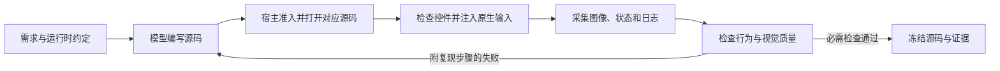

# 模型驱动的应用开发与验证

[English](MODEL-VALIDATION.md) | 简体中文

宿主提供相应工具后，编码模型可以编写应用、查看实际渲染结果、注入输入并修复失败。
完成与否取决于最终源码的验证证据，不能仅凭工具调用成功或模型自己的总结。
本指南配合所选[设计流程](../flows/README.zh-CN.md)使用，不替代准入、视觉评审或发布检查。

Glance 卡片可进一步使用 [AppCard UX 技能](../skills/octoscript-app-card-ux/SKILL.md)，
补充工作区展开、共享编辑状态、手机键盘可达性和上下文保留的任务流程与验收矩阵。
该技能复用本文的模型验证循环，不另建模型服务或截图协议。

**证据核对日期：2026-10-03。** [DeepSeek 第 12 轮与 MiniMax 第 14 轮合集](https://github.com/OctoSense-org/OctoScript-App-Design-Flow/blob/e9459ca1ebd2401d03673bd3c94de0270ccd3231/examples/android-a2app-card-templates/continuations/REVIEW.zh-CN.md)
各包含六类由 Android 上的模型编写的离线应用原型。独立 Agent 评审给两者的综合分均为
4.5/5、视觉分均为 4.4/5。操作人员提供了反馈和独立测试；这些结果证明了有人监督的开发流程，
尚不能证明无人干预、完全在手机内完成的验证，也不代表真实服务已完成或模型能力排名。

## 选择测试方式

| 方式 | 模型可以驱动什么 | 这些证据不能证明什么 |
| --- | --- | --- |
| 桌面 Makepad instrument / `makepad_test` | 自己启动的隐藏原生进程；控件选择器、真实输入事件、渲染截图、等待和断言 | Android 键盘、权限、通知和生命周期行为 |
| Android 上的 OctoSense App Studio | `studio.open`、`studio.input`（点击/文本/滚动）、`studio.inspect`、`studio.close`，仅作用于调用者的受控应用实例 | 任意其他 APK，或完全隐藏的手机测试会话；该版本会打开可见应用 |
| Android `studio.render` | Home 在前台时，按设备概览区宽度把 L0 卡片和测试数据渲染为 PNG | 导出卡片的点击、交互实例状态或已发布到 Shell |
| Android 平台截图 | 另行实现并获得授权的截图服务，可采集显示屏或所选应用/窗口 | Makepad 控件几何、应用内部状态或任意 APK 的离屏运行环境 |

桌面路径通过 Makepad 事件分发和帧缓冲截图工作，不依赖 Android UI 自动化。
参见[原生 instrument 手册](../flows/core/NATIVE-INSTRUMENT.md)和
[隐藏窗口 / `makepad_test` 示例](QUICKSTART.md#4a-headless-test-without-the-screen-several-apps-at-once)。
这里的 headless 指有图形会话支持的隐藏原生窗口，不代表已经验证无显示环境的软件渲染器。

OctoSense App Studio 在 Android 上的输入同样经过 Makepad，inspect 读取应用的渲染纹理。宿主完成工具注册和授权后，
模型可以直接调用，逐次点击并不天然需要桌面操作人员。已评审的手机构建为 OctoSense `ccf8013f`，
范围由其[工具声明](https://github.com/OctoSense-org/OctoSense/blob/ccf8013f2bd7adbb6c20d5f52f47bcfbcbb55313/crates/shell/src/host_tools/studio.rs)
及[实例事件与截图实现](https://github.com/OctoSense-org/OctoSense/blob/ccf8013f2bd7adbb6c20d5f52f47bcfbcbb55313/crates/shell/src/studio/apps.rs)
确定。这里记录的是该构建的能力，不保证所有已安装版本或本仓库另外锁定的运行时都有这些工具。
在手机上发起开发也不等于模型推理在手机本地进行。

这里的 App Studio 指 OctoSense 内置开发工具，不是 Google 的 Android Studio IDE。
每种提供商/模型配置都要验证图像传递路径：宿主必须以受支持的输入格式交付实际截图，
不能只传本地文件名或工具回执。使用已知截图，检查模型能否识别随附控件文本中没有的可见细节。
生成 PNG 成功不证明图像已送达模型，也不证明模型理解了图像。如果该检查失败，
将视觉评审标为未验证，并在修复提供商集成期间交给具备图像能力的评审者或人来检查。

### 截取其他 Android APK

以下标准 Android API 可以在手机内使用，无需 PC 或 root。OctoSense 仍需实现相应宿主服务，
并将其接入模型工具；已评审的 Studio 工具没有提供这个跨应用桥接。

- **MediaProjection：** 用户授权一个截图会话。Android 14+ 还支持选择单个应用，
  必须遵循系统的会话授权和前台服务要求。[Android 指南](https://developer.android.com/media/grow/media-projection)
- **AccessibilityService：** 用户启用且声明截图能力的无障碍服务，在 Android 11+
  可以截取显示屏，在 Android 14+ 可以截取无障碍窗口。手势分发是另一项能力，
  截图授权本身不授予输入控制。[Android API](https://developer.android.com/reference/android/accessibilityservice/AccessibilityService)
- **受保护内容：** `FLAG_SECURE` 可能阻止截图或使受保护区域留白。记录这个限制，
  不要将其当作渲染失败，也不要绕过保护。[Android 说明](https://developer.android.com/security/fraud-prevention/activities#FLAG_SECURE)

平台截图必须单独标注。完整 Android 截图可以证明应用纹理 PNG 不包含的键盘遮挡或通知展示，
但不能替代原生渲染检查要求的应用自身截图。截取其他 APK 不会授予其私有存储访问权，
也不会建立通用的隐藏 APK 测试环境。本指南只记录系统支持的路径，没有新增跨应用实现或实机测试。

## 完整的评审循环



1. **定义可观察的结果。** 列出页面、操作、记录身份、数据来源，以及哪些状态必须跨重启保存。
   卡片合集的 L0/L1/L2 指概览、展开、完整应用三个展示深度，`.card` 的语言准入另行记录。
   明确标注虚构数据和不可用的媒体功能。
2. **提供真实的运行时约定。** 给模型锁定版本的 API、工作参考、允许的工具及宿主限制。
   先确认工具授权，再让模型修应用代码。比较独立创作时，不要让一个模型借用另一个模型的应用源码。
3. **先做一条完整功能路径。** 打开有内容的页面、执行一个有意义的操作并观察状态变化，再推广结构。
   后续修复保持小范围，保留已经工作的行为和控件 ID。
4. **证明初始化完成。** 准入、存在根控件、打开成功是不同检查。
   等待初始数据和定时器，检查预期字段、查看 PNG 和运行时错误。只初始化了一部分的外壳仍然失败。
5. **驱动真实操作路径。** 主操作、撤销、选择第二条、筛选、滚动到最后一条、打开详情、返回，都要覆盖。
   根据需求测试实际存在的空态/错误态、空输入校验、键盘出现时的操作可达性和重启行为。
   描述某个状态的文字不等于测试了该状态。
6. **同时看断言和像素。** 检查完整标题、正负数、单位、换行、主要操作及持续显示的选中状态。
   按逻辑点检查实际可见点击区域。控件快照可能保存了完整字符串，但截图已经截掉最后几位数字。
7. **把可复现的失败交回作者。** 附源码凭据、起始状态、原生操作、预期/实际结果、原始 PNG 和控件/日志证据。
   要求针对性修复，再重新打开并复测受影响路径。为检查和关闭实例预留工具调用次数；
   相互依赖的打开、输入、检查、关闭必须顺序执行。
8. **冻结并验证。** 将最终报告绑定到应用、manifest、卡片、数据文件的哈希及运行时/构建身份。
   修改后重新检查；失败记录与修正后的复测分别保留。关闭自己启动的实例，恢复临时配置，
   明确列出未验证的服务和平台。

第二位评审者或确定性测试工具能补充作者自己漏掉的问题。如果作者同时评审自己的输出，要明确记录。
最终报告必须说明谁生成源码、谁注入输入、谁评估截图；操作人员执行的测试不能写成模型自主完成的验证。

## 应对实测中的模型弱点

下面是[归档测试](https://github.com/OctoSense-org/OctoScript-App-Design-Flow/blob/e9459ca1ebd2401d03673bd3c94de0270ccd3231/examples/android-a2app-card-templates/continuations/REVIEW.zh-CN.md)中的可复现失败模式，
不是给某个提供商贴永久标签。[MiniMax 历史记录](https://github.com/OctoSense-org/OctoScript-App-Design-Flow/blob/e9459ca1ebd2401d03673bd3c94de0270ccd3231/examples/android-a2app-card-templates/continuations/minimax/turn-14/history/index.json)
保留了中间源码诊断与后续修复。

| 失败模式 | 纠正反馈与验收方式 |
| --- | --- |
| 混用 `.card` 与 Splash 语法 | 提示词明确语言。Splash 注释用 `//` 或 `/* … */`，`#` 开始颜色词法解析。`.card` 的主题声明必须是真正的源码，不能写成 `# theme …` 注释。重新打开或渲染修复后的准确文件。 |
| 容器提前闭合 | 指出哪个属性行在预期子控件之前关闭了容器，以及后面哪个闭合符变得多余。要求最小结构修复；缩进和简单括号计数都不能替代解析与初始化检查。 |
| 臆造或误诊 API | 给替代建议前，核对锁定版本实现及通用控件分发。例如[控件 API](SCRIPT-API.md#uiid-reading-and-changing-widgets) 通用地提供 `set_visible`，不能因某个按钮实现中没有同名方法，就判断它不支持。评审反馈本身也需要证据。 |
| 把部分启动当作成功 | 启动后检查字段已填充，并执行一个改变状态的操作。归档中既有无根控件，也有部分根控件以及 `#` 文字中断函数的案例。没有耗尽证据时，不要盲目提高指令额度。 |
| 离线 L0 数据源失败 | 数据键使用 source 别名，遵循锁定渲染器的离线字面量约定；这些示例省略在线 dataset ID，并在 `.$state == .ready` 内读取生命周期绑定字段。不要把这种配置当作真实在线服务。 |
| 文本断言通过，像素却丢内容 | 返回原始截图和测量边界。Finance 把 `-0.38` 显示成 `-0.3` 是数据展示错误。给内容足够空间，同时保留操作尺寸；完整列表与筛选列表都要复测。 |
| 把焦点颜色当作选中状态 | 点击其他控件后，当前展示深度/筛选仍应清晰。先执行子操作及详情/返回，再截图。 |
| 导航后打开错误记录 | 使用有区分度的数据，检查第二条/最后一条的身份、各条独立且可逆的状态；即使先选择过其他记录，概览操作也必须打开当前展示的记录。 |
| 卡片过密或主题修改没生效 | 在记录的宽度和缩放比例下测量实际卡片高度，将卡片组件与整个演示页留白分开评价。核对支持的主题声明；解析器接受某个主题轴，不代表宿主支持它。 |
| 总结过时或自报计数不准 | 文件修改数、工具调用数、失败数来自调用记录与哈希。修改后，旧截图只作历史证据。渲染的 `settled:true` 不证明交互；该 Studio 版本原生检查的 `settled:false` 本身也不等于失败。 |
| 错误选择器被当作应用缺陷 | 检查当前可见、启用的控件，需要时先滚动。只有目标行为未变时才更新操作人员的预期。保留失败并解释输入修正，不要靠删除断言取得通过。 |
| 工具权限或过长轮次使修复失控 | 先在宿主修正授权/工作区问题，再考虑修改应用源码。每次给模型一个有明确范围的修复目标。同一失败反复出现且没有新证据时，检查解析器/运行时并提供准确诊断，不要要求大范围重写。在工具额度耗尽前保存源码哈希、已验证路径及剩余工作的检查点。 |

要求模型创作的实验中，评审者可以编写测试工具和反馈，但应用/设计修改必须交给指定作者。
保留原始源码字节与成功修改记录，使用[续作导入和重放流程](https://github.com/OctoSense-org/OctoScript-App-Design-Flow/blob/e9459ca1ebd2401d03673bd3c94de0270ccd3231/examples/android-a2app-card-templates/continuations/README.zh-CN.md)。
归档中不能包含提供商配置、凭据或私有推理。

## 给模型的可执行反馈

```text
产物：<版本及源码凭据>；运行时：<构建身份>。
起始状态：新开的 Finance 预览，显示全部记录。
操作：进入 L2，打开第二个标的。
预期：标题、价格和带正负号的完整变化值可读。
实际：PNG 显示 -0.3，而数据及控件文本为 -0.38。
证据：<原始 PNG>、<原生快照>、<输入序列记录>。
修复：调整相关布局，不修改数据或操作语义。
复测：负数详情、全部/筛选列表、可逆关注状态、返回概览后的记录身份。
报告剩余失败，不自行打分。
```

行为通过数、几何问题和视觉判断分别记录。A−/4.5 目标必须对应明确评审标准，
不能豁免功能失败，也不能替代[发布检查](PUBLISHING.md)。离线原型完成不证明真实邮件发送、
日历同步、行情获取、图片加载、视频播放或服务状态的持久化。
