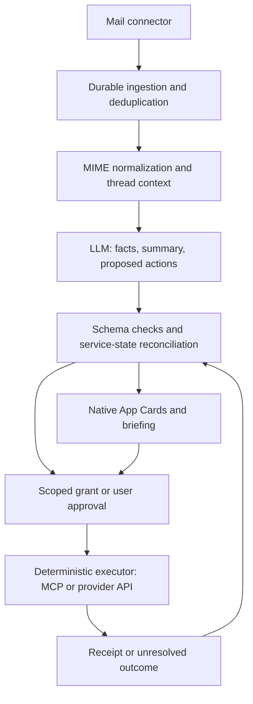

OctoSense agentic email: feasibility assessment

2026-09-13 · Proposed architecture, informed by source review and official Google documentation. No user mailbox was accessed; model accuracy, latency, cost and user acceptance remain unmeasured.

The product is technically feasible. Build a background mail observer that turns correspondence into explanations, decisions and tracked service state. Users interact through native cards, briefings and an optional source reader. A conventional inbox, folder manager and full mail composer are not prerequisites. Reliable ingestion, account authorization, message parsing and sending remain backend responsibilities.

Google explicitly lists generative AI email summaries and email-based itinerary/package monitoring among permitted Gmail use cases. This supports the product direction, subject to the application's actual access and data handling; it is not a claim that OctoSense has passed app review. [Workspace user-data policy](https://developers.google.com/workspace/workspace-api-user-data-developer-policy)

**Feasibility by capability**

| Capability | Engineering assessment | What must be established |
| --- | --- | --- |
| Summaries and daily briefings | Practical first capability | Factual grounding, source links, useful prioritization and no silent omissions |
| Extract dates, amounts, contacts, tracking numbers and requested replies | Practical with typed extraction and validation | Ambiguous dates, time zones, amended instructions and attachment coverage |
| Draft replies for review | Practical | Correct recipient/thread, user-editable content and approval bound to the final draft |
| Calendar proposals and scoped automatic updates | Practical with a real Calendar connector | Conflict checking, explicit standing grants, update receipts and compensating undo |
| Shipment cards | Practical when order/tracking access exists | Stable order identity, genuine provider updates and freshness |
| Clinic/installer booking and payments | Provider-dependent | A working provider API or verified handoff; email content alone cannot complete the transaction |
| Completely unattended handling of arbitrary correspondence | Unsuitable as the initial promise | Unknown intents, ambiguous instructions, external capabilities and consequential mistakes |

These are implementation judgments, not measured model benchmarks. User review and recoverable operations make a bounded release practical before broad autonomy is justified.

**The interaction model**

Organize the app around three views: Needs your decision, Handled for you, and Briefing. The desktop shows timely subsets of the same service records. Opening a card reveals its details, origin and controls. Search, opening the original email/attachment, correcting a proposal and composing a custom reply remain accessible as lightweight supporting views.

One message may produce multiple service records: a school event and a fee request. Several messages may instead update one record: purchase confirmation, dispatch, delayed delivery and arrival. A follow-up changing Friday to Monday must revise the existing event and invalidate its stale pending approval. It should not leave two independent appointment cards.

| Email content | What the model produces | What the user sees or does |
| --- | --- | --- |
| School event from previously authorized Lin | Event facts with source evidence; separate invoice facts | After a permitted Calendar write succeeds, a calendar card shows the change. Acknowledge or undo it; decide on the fee independently |
| Purchase/dispatch/delay messages | Links to the same order and tracking service | One evolving delivery card; an installer card appears only when actual booking choices are available |
| Checkup invitation | Provider-offered options and booking intent | Select options/time and submit to the provider; distinguish booking confirmation from calendar insertion |
| Reunion invitation and reminders | Event, RSVP choices and contribution request | RSVP, calendar and contribution controls remain separate |
| Newsletter or routine receipt | Grounded summary or informational record | Briefing entry, with no interruption unless a user rule makes it relevant |
| Unclear or unsupported request | Explicit uncertainty and source evidence | A focused choice, editable reply or source view; the item remains discoverable |

**Processing architecture**

The mail observer runs independently of conversational turns. It can poll or consume notifications even when the user is not chatting. An always-on host is needed for continuous processing while the laptop sleeps; a local-only release processes when running and catches up on resume. The published Astro/WASM preview requires a trusted backend for this work.

The model receives relevant message content and related service context. It returns a bounded schema: summary, extracted facts, evidence references, unresolved questions and proposed action kinds. It does not receive authority to invent new tools or grant itself permissions. The executor resolves the selected command against an installed connector and current service record.

For example, a `calendar.propose_change` intent is an internal domain command, not an assumed provider tool name. The adapter maps it to a verified external schema. Critical fields include account, calendar, source messages, event identity, time zone, requested change, previous version and approval requirements. A numeric model confidence score alone cannot authorize execution.

**How to use the existing design pipeline**

Keep image generation and image-to-Makepad conversion in the design/build workflow. Ship reviewed native templates for briefing, reply, calendar, tracking and payment-request cards. At runtime the model chooses among these schemas and supplies content; deterministic code supplies permitted buttons and status.

The binding layer maps data fields to widgets and semantic control IDs to stored commands. User clicks reference action IDs and card revisions. Text length, localization and missing data use defined layout behavior. A new unknown service can use a generic review card until its specialized template and adapter are implemented. Do not generate executable Makepad code or recompile WASM for each email.

The existing school reducer already has `ack_calendar`, `pay_fee`, revision checks and demo state transitions. Preserve these interaction semantics while moving business state to the backend. Its initial calendar success and payment receipts are fixtures today. Production cards display completion only from actual connector results. [School reducer](/workspace/home/Octosense-Service-AppCards/flows/school/wizard/service.mjs:96)

**Backend transport does not dictate the UI**

POP3 + SMTP can prove the concept. POP downloads messages and the observer builds its own state. IMAP is useful for broader provider compatibility and mailbox synchronization. Gmail REST offers provider message/thread identities, incremental history and narrower authorization scopes. None of these choices requires a traditional inbox UI. [Gmail protocols](https://developers.google.com/workspace/gmail/imap/imap-smtp), [Gmail incremental sync](https://developers.google.com/workspace/gmail/api/guides/sync)

For a Gmail-only production connector, prefer Gmail API reads and a separately authorized send path. An initial scope set can be `gmail.readonly` and, when sending is enabled, `gmail.send`; drafts can remain local. Server-side draft management requires a suitable additional scope. POP/IMAP/SMTP OAuth uses the broad `https://mail.google.com/` scope, so POP is not inherently simpler for public OAuth approval. [Gmail scopes](https://developers.google.com/workspace/gmail/api/auth/scopes), [protocol OAuth](https://developers.google.com/workspace/gmail/imap/xoauth2-protocol)

Gmail push is an optional backend optimization over incremental synchronization. It signals mailbox changes; it does not deliver a complete parsed message or replace recovery sync. A local-only first version can use polling. [Gmail push](https://developers.google.com/workspace/gmail/api/guides/push)

**What Octos already has, and what to change**

The email channel in the local Octos checkout was also compared with GitHub commit `1416d36e48769c4a9c3da375c20e6da6336298fe`; its contents match. This extends the earlier MCP assessment with a concrete reusable email implementation.

| Existing code | Reuse | Necessary change |
| --- | --- | --- |
| `octos-bus/src/email_channel.rs` | TLS IMAP, `mailparse`, message/thread headers and SMTP | Convert the channel into an observer source instead of treating every external message as a conversation input |
| IMAP polling at line 105 | Connection and parsing scaffolding | Replace `UNSEEN` as the processing cursor; users reading email elsewhere must not cause the observer to miss it |
| Fetch/mark-seen at lines 165 and 220 | Protocol implementation reference | Use non-mutating fetch and durable processing checkpoints; current code marks fetched mail seen before gateway enqueue |
| Plain-text extraction at line 410 | MIME parsing baseline | Handle HTML-only messages, MIME alternatives and supported attachments; track incomplete coverage explicitly rather than silently dropping them |
| Password login at line 132 | Test-account adapter if app passwords are available | Implement Google OAuth/XOAUTH2 and token refresh for the product |
| MCP client, approval model and scheduler | Tool execution, suspension/resumption and background scheduling | Add account-scoped tools, structured results, domain grants and durable operations, as documented in the prior assessment |
| SMTP channel and `send-email` skill | Outgoing transport | Bind exact recipients/content/thread headers to approved drafts; return a meaningful execution outcome |

For IMAP, store account/mailbox identity, UIDVALIDITY and processed UIDs independently of read flags; handle resets with reconciliation. For POP, persist account-scoped UIDLs and avoid deletion on ingestion. Provider IDs are primary deduplication keys; a message's `Message-ID` header is useful context, not a globally trusted unique identifier. MCP can expose the observer's typed capabilities to Octos, but wrapping a local service in MCP is optional when a direct tool implementation suffices.

Do not enable the existing gateway email channel unchanged against a personal inbox and assume it implements this product. Its outbound route is SMTP to the sender; normal user-facing summaries must instead be delivered to the account owner's App Card surface. Sending email is a distinct, approved action.

**Reliability requirements that determine feasibility**

- Preserve the original meaning and evidence. Strip duplicated quotations for processing but retain enough source context to explain dates, costs and obligations. Inspect amendments and cancellations across messages. Resolve a service by account, participants and stable identifiers, not subject similarity alone.
- Keep mail content untrusted. An email saying to ignore instructions or approve a payment cannot change grants. Sender display names cannot establish a trusted contact. Enforce action scopes outside the model.
- Bind approval to the final action. If a user edits a reply, the approved content must be that revision. Calendar approval covers a particular event/change, not any future update. Standing grants are explicit and independently revocable.
- Track execution durably. Duplicate notification, repeated click or restart must not repeat a successful action. A timeout can mean an unknown outcome; reconcile before retrying. SMTP acceptance establishes submission, not proof that the recipient received or read the message.
- Make correction possible. Show “review needed” when important fields are ambiguous. Removing a card is different from cancelling a booking; undo after execution uses a supported compensation. Sent mail cannot be promised universally retractable.
- Measure missed work as well as wrong actions. Suppressing every uncertain email reduces mistakes but can hide urgent requests. Maintain a visible unreviewed/uncertain queue and show synchronization and analysis coverage.

**Cost and deployment assessment**

Process each new message once, then re-evaluate only affected threads or service records. Use lightweight routing and extraction for straightforward messages, richer analysis when needed, cached service summaries and grouped non-urgent briefings. Prefer deterministic invoice/ICS parsing when structured content is available. Even messages routed into a digest must remain recoverable and included in coverage accounting.

Illustrative workload, not a measured benchmark: 100 emails/day × 30 days × 1,500 input tokens is 4.5 million input tokens/month; 200 output tokens/email adds 0.6 million output tokens. Dollar cost is those volumes multiplied by the chosen model's input/output rates, plus attachments, additional reasoning, retries, storage and hosting. Repeatedly scanning the entire mailbox or performing image generation per message would change that budget substantially. Benchmark an authorized corpus before selecting models or promising latency.

A public Gmail integration has a release dependency on OAuth verification and, where applicable, restricted-data security assessment. Sending content to a hosted model must fit disclosed user-facing processing and the selected provider's data terms. Workspace policy permits summaries but restricts reuse for general model training. Local inference changes the deployment tradeoff but still needs real accuracy and performance measurements. [Scope requirements](https://developers.google.com/workspace/gmail/api/auth/scopes), [permitted uses and limited use](https://developers.google.com/workspace/workspace-api-user-data-developer-policy)

**First release and evidence needed**

Build a single-account observer with recent-mail ingestion and ongoing changes, grounded summaries, editable reply proposals, calendar cards and informational tracking cards. Keep payment requests as clearly labeled handoffs until a real payment integration exists. Start with all external writes reviewed; add a narrowly scoped Lin/calendar grant after reviewing its behavior.

Evaluate on a user-authorized, representative set of roughly 200–500 messages including newsletters, transactions, follow-ups, changed dates, forwarded mail, HTML-only mail and ambiguous requests. This is a proposed initial test set, not data already acquired. Then run a shadow period in which the system proposes actions without performing external writes.

Measure factual correctness, actionable-email recall, false interruptions, date/amount/recipient accuracy, edits required before sending, time to card, cost per processed message and handling of changed/cancelled instructions. Test duplicate delivery, stale approvals, restart during execution and compensation after manual edits. Unauthorized or duplicated writes in the bounded test suite block enabling automatic execution; passing the suite does not prove arbitrary future mail is safe.

The first complete demonstration should be: a real school email arrives; Octos extracts an event and a separate fee request; a scoped calendar grant produces a verified update; both app and desktop show the same card; the user can acknowledge or undo the calendar change and independently edit/approve a reply. This demonstrates the intended product without building a full conventional email application.

Supporting source assessment: [Octos MCP and external services](./octos-mcp-external-services.md). Local code: [email ingestion](https://github.com/octos-org/octos/blob/d03ab424fc126c6eb8b9a90db35442c470b5ebed/crates/octos-bus/src/email_channel.rs#L105), [gateway adapter](https://github.com/octos-org/octos/blob/d03ab424fc126c6eb8b9a90db35442c470b5ebed/crates/octos-cli/src/commands/gateway/adapters/email.rs#L10), [SMTP skill](https://github.com/octos-org/octos/blob/d03ab424fc126c6eb8b9a90db35442c470b5ebed/crates/app-skills/send-email/src/main.rs#L42), [approval model](https://github.com/octos-org/octos/blob/d03ab424fc126c6eb8b9a90db35442c470b5ebed/crates/octos-agent/src/approval.rs#L98).
