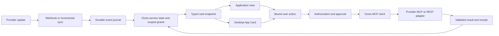

Octos MCP → external services → native App Cards

Checked on 2026-09-13. This is a source and documentation assessment, not a completed live integration. No accounts were connected and no external data was read or changed.

Octos already has the transport needed to call external MCP tools. The remaining product work is account binding, provider authorization compatibility, durable event processing, typed service state, and the native card action bridge. MCP does not require a chat interface; the same service state can appear inside Mail, Calendar or Shopping and in a desktop App Card. [MCP interaction model](https://modelcontextprotocol.io/specification/2025-11-25/server/tools)

The inspected runtime checkout was at `d03ab424fc126c6eb8b9a90db35442c470b5ebed`, with unrelated working changes. GitHub main was also checked at `1416d36e48769c4a9c3da375c20e6da6336298fe`. Its MCP client, OAuth implementation, MCP CLI and card producer are byte-identical to the inspected local files. The approval module differs only in formatting a digest. Other supporting code references below describe the local checkout. No runtime source was modified.

**What already exists**

| Capability | Implementation | Consequence |
| --- | --- | --- |
| MCP client | `crates/octos-agent/src/mcp.rs:53,374` | `rmcp` client with stdio and Streamable HTTP; initialization, paginated tool discovery, tool calls, timeouts and per-server startup failure isolation |
| OAuth | `crates/octos-agent/src/mcp_auth.rs:105,186` | Browser authorization, discovery, dynamic registration, PKCE, OS keyring and runtime refresh |
| Configuration | `crates/octos-cli/src/config.rs:82` | `mcp_servers` is an array; project-local `.octos/config.json` is one supported configuration location |
| CLI | `crates/octos-cli/src/commands/mcp.rs:20` | `octos mcp login <url> --scope <scope>` and `logout`; there are no add/list commands in this command enum |
| Tool access | `crates/octos-agent/src/tools/policy.rs:29` | Allow/deny rules; deny wins. This controls tool access, not contact-specific business authorization |
| Human approval | `crates/octos-agent/src/approval.rs:98` | Suspend/resume requests bound to argument digest, authorized approvers and originating room; replay protection |
| Scheduling | `crates/octos-bus/src/cron_service.rs:635` | Scheduled jobs can trigger gateway processing; this does not implement provider synchronization by itself |
| Email transport, found in follow-up review | `crates/octos-bus/src/email_channel.rs:105` | Existing IMAP polling, MIME text extraction and SMTP delivery; currently a gateway messaging channel, requiring adaptation into a durable mail observer |
| Existing card delivery | `crates/octos-agent/src/tools/send_app_card.rs:1` | Structured `org.octos.app` payloads and actions, currently describing Robrix/Matrix weather and mission-room rendering |

The separate `octos mcp-serve` implementation exposes `run_octos_session` to an outside orchestrator. It is the reverse direction and is not how Octos connects to Gmail.

**Provider choices and current limits**

| Provider | Verified interface | Use in OctoSense |
| --- | --- | --- |
| Gmail | Official remote MCP: `https://gmailmcp.googleapis.com/mcp/v1`; Developer Preview, Google Cloud setup and OAuth client required | Read threads, search mail, create drafts and manage labels. The published tool list does not include sending. Use a separate narrow Gmail API adapter for approved sending, or hand off the draft to Gmail |
| Google Calendar | Official remote MCP: `https://calendarmcp.googleapis.com/mcp/v1`; Developer Preview and OAuth | Read availability/events; create, update and delete events |
| Shopify storefront | Public store-specific `/api/mcp` for cart/policy tools; separate `/api/ucp/mcp` for catalog tools | Product selection and cart cards; checkout handoff |
| Shopify customer account | Discover `mcp_api` from the store's `/.well-known/customer-account-api`; OAuth authorization code + PKCE | That customer's order/account operations, subject to store integration and scopes |
| AfterShip | Official Post-purchase MCP docs describe Streamable HTTP and OAuth, but the published server URL and installation commands still say `preparing...` | Do not configure a guessed endpoint. Start with a narrow MCP adapter over the documented Tracking REST API |

Google sources: [Gmail MCP](https://developers.google.com/workspace/gmail/api/guides/configure-mcp-server), [Calendar MCP](https://developers.google.com/workspace/calendar/api/guides/configure-mcp-server). Gmail sending can use `users.drafts.send` or `users.messages.send` through the [Gmail REST API](https://developers.google.com/workspace/gmail/api/guides/sending).

Shopify's current catalog tools include `search_catalog`, `lookup_catalog` and `get_product`; these use the UCP endpoint and require an agent profile in request arguments. `get_cart`, `update_cart` and `search_shop_policies_and_faqs` use the standard endpoint. `get_cart` returns a checkout URL. Store access can vary. Discover actual schemas with `tools/list`: the documentation's cart parameter summary and sample differ, so do not hardcode the sample as an authoritative schema. [Storefront MCP](https://shopify.dev/docs/apps/build/storefront-mcp/servers/storefront)

Customer-account MCP requires store/app setup and protected customer-data access; its documentation says to discover available tools. Customer authorization does not grant merchant Admin API or merchant webhook access. An OctoSense consumer cannot subscribe to arbitrary shops' merchant events simply by signing into a customer account. [Customer Accounts MCP](https://shopify.dev/docs/apps/build/storefront-mcp/servers/customer-account), [Shopify webhooks](https://shopify.dev/docs/apps/build/webhooks)

AfterShip's documented MCP tools include `list_shipments` and `get_shipment`, with organization-role and product-plan limits. This is an organization's tracking/returns connector, not universal access to every consumer parcel. The REST alternative uses `as-api-key`; keep it in the backend adapter's credential store. [MCP availability](https://www.aftership.com/docs/post-purchase-mcp/overview), [installation status](https://www.aftership.com/docs/post-purchase-mcp/install/claude-code), [Tracking API](https://www.aftership.com/docs/tracking/quickstart/api-quick-start)

**Concrete configuration supported by today's Octos schema**

This is a template to merge into an appropriate runtime/profile configuration. Replace the shop placeholder. It was syntax-checked, not connected to a live store. Do not overwrite an existing configuration with this fragment.

```json
{
  "mcp_servers": [
    {
      "url": "https://YOUR-SHOP.myshopify.com/api/mcp",
      "concurrency_class": "exclusive"
    },
    {
      "url": "https://YOUR-SHOP.myshopify.com/api/ucp/mcp",
      "concurrency_class": "safe"
    }
  ]
}
```

These two endpoints have different tool sets. The UCP agent-profile argument still needs to be supplied on relevant tool calls. `exclusive` serializes work in Octos; it does not mean “requires approval.” This fragment does not configure business authorization or an allowlist.

For an installed, reviewed local adapter, today's configuration can instead use `command`, `args`, and an `env` map. Prefer a pinned executable that obtains provider credentials from the keyring. A local adapter should use stdio: Octos currently rejects localhost/private-IP remote MCP URLs as an SSRF defense. Do not disable that protection just to connect a local service.

For OAuth servers compatible with Octos's current dynamic-registration flow, set `url`, `oauth: true`, and explicitly run `octos mcp login <url> --scope <scope>` during account setup. The CLI takes scopes directly; its login path does not look up the configured server's `scopes` field. Do not assume this command completes Google's or Shopify's documented pre-registered-client flow without the changes below.

**Runtime changes needed for reliable service cards**

1. Preserve structured MCP results. `McpTool::execute` at `mcp.rs:586` currently joins `content[].text` and drops non-text content and `structuredContent`. Discovery also omits `outputSchema` and annotations. Keep the provider result, validate its output schema where supplied, and map it into typed domain data. `ToolResult.structured_metadata` already offers a possible host-side transport at `tools/mod.rs:560`; it still needs end-to-end propagation. Text-encoded JSON may work today, but is not a substitute for this contract. [MCP result schemas](https://modelcontextprotocol.io/specification/2025-11-25/server/tools)

2. Bind tools and credentials to accounts. MCP tools currently register under their raw remote name; the registry inserts by name and a later duplicate replaces an earlier entry (`tools/registry.rs:536`). Introduce an internal identity such as `(profile_id, connection_id, account_id, remote_tool_name)`, plus a unique model-facing alias while retaining the original name for `tools/call`. The keyring currently keys only by URL (`mcp_auth.rs:57`), so multiple Google accounts at the same endpoint share a credential entry. Give each connection its own credential identity.

3. Support provider OAuth variations. `McpServerConfig` and the login CLI do not expose pre-registered `client_id`, client-secret reference, explicit authorization/token endpoints, or a configurable registered callback. Add these without removing the existing DCR path. Persist refreshed/rotated tokens after mid-session refresh as well as login/startup. The existing ADR already records the restart limitation. Google and Shopify compatibility is an implementation requirement inferred from their documented flows, not a successful login test.

4. Apply service-level authorization. Current approval rules match tool names, not “Lin may update the family calendar but may never spend money.” Add scoped grants over account, verified contact identity, action kind, target calendar/resource and constraints. Sender display names and email text cannot create these grants. A card click should identify a stored action; the server resolves its bound arguments and checks the grant or approval. Do not expose arbitrary `tools/call` from the browser.

5. Add durable provider events and reconciliation. The agent `EventBus` is for progress events. The inspected webhook proxy handles messaging channels, not Gmail/Calendar/Shopify/AfterShip synchronization. Add provider-specific ingress, cursors, deduplication, an operation journal and retries with reconciliation. MCP tool-list notifications and a live HTTP connection do not automatically notify Octos of a newly delivered package.

6. Connect the native service cards. The current `send_app_card` producer is useful precedent, but it is not already wired to the website's school/health/reunion reducers or a desktop service-card registry. Define a typed service snapshot and action transport, then render the same state in the app and shell. The current reducers are demonstrations: `nextUpdate` simulates updates and `goBack` restores local history. Neither is a real provider event or external undo.

7. Keep connection setup separate from skill content. The local skill manifest's `SkillMcpServer` supports stdio/static HTTP; `plugins/extras.rs:203` explicitly sets `oauth: false` and empty scopes. Configure accounts through the runtime/profile path for now. A future service package can declare capability requirements and bind an existing connection, without embedding tokens in generated cards or skill manifests.

**How background updates reach the cards**

| Source | Background mechanism | Receiver work |
| --- | --- | --- |
| Gmail | Gmail `watch` → Cloud Pub/Sub; for a local-device first version, incremental polling is a practical alternative | Persist `historyId`; fetch changes with `history.list`; renew watch before expiration; catch up after missed notifications |
| Calendar | Calendar resource `watch` → HTTPS callback | Validate channel identity/token; fetch actual changes; persist `nextSyncToken`; rebuild the relevant cache on invalid-token 410 |
| AfterShip | Tracking webhook | Verify `aftership-hmac-sha256` against the raw body; deduplicate deliveries; normalize tracking checkpoints |
| Shopify merchant integration | Authorized app subscriptions to relevant order/fulfillment topics | Verify HMAC and deduplicate webhook IDs; use the authorized store/account mapping |
| Shopify consumer integration | Customer-account reads and authorized email/tracking signals | Reconcile that customer's orders without assuming access to merchant webhooks |

Gmail notifications identify mailbox history, not the full new email. Calendar callbacks have no event body. Their adapters must fetch the actual changes before updating a card. Cloud webhook receivers also need durable queuing while a user's MacBook is asleep; a local-only first release should describe background behavior accordingly. [Gmail push and renewal](https://developers.google.com/workspace/gmail/api/guides/push), [Calendar push](https://developers.google.com/workspace/calendar/api/guides/push), [Calendar incremental sync](https://developers.google.com/workspace/calendar/api/guides/sync), [AfterShip signatures](https://www.aftership.com/docs/tracking/webhook/webhook-signature)

**Proposed execution flow**



The diagram is proposed integration work. Authentication tokens remain in the trusted Octos host or connector backend. Astro and Makepad WASM receive scoped service snapshots and action identifiers, not provider keys. A trusted desktop can host Octos locally; a public website needs an authenticated backend/session boundary.

Use the model to extract intent and suggest an action. Use deterministic code to execute a confirmed card action, update state from the provider response and reconcile uncertainty. A payment, booking or email-send timeout must not produce success text or an automatic duplicate submission.

Suggested domain records, not existing Octos types:

```text
ServiceEvent:
  connection_id, account_id, provider_event_id, resource_id,
  provider_version, observed_at, payload, source_refs

ServiceCard:
  card_id, service_id, revision, kind, status,
  display_data, source_refs, permitted_action_ids, updated_at

BoundAction:
  action_id, card_id, expected_revision, connection_id,
  remote_tool_name, canonical_arguments, arguments_digest,
  grant_or_approval_id, expires_at, idempotency_key

OperationReceipt:
  operation_id, provider_resource_id, provider_version,
  status, completed_at, compensation_reference
```

Idempotency is an application journal plus provider-specific guarantees, not a property bestowed by MCP. Record a request before execution; reconcile ambiguous outcomes before retrying. Revision checks reject stale card actions. Undo invokes a supported compensating operation and preserves unrelated edits; it does not reset the entire service to an earlier demo frame.

**Applying this to the four existing scenarios**

| Scenario | App experience | Desktop card and real operation |
| --- | --- | --- |
| Lin's school email | Show the original mail and linked calendar/invoice state | If an existing scoped grant permits the change, write the calendar first and show “已更新” only after success. “确认” acknowledges the completed update; “撤销” compensates that particular event change. The fee is a separate invoice/payment workflow |
| Air-conditioner purchase | Show selected product/cart/order and shipment timeline | Shopify supports the shopping/order parts; tracking updates drive the delivery card. Installation-slot selection requires the installer's booking API. Arrival does not itself confirm an installation appointment |
| Annual checkup | Show provider-offered packages and appointment availability | Provider booking API confirms the appointment; Calendar checks conflicts and stores a linked event. Removing a calendar event and cancelling a clinic appointment are distinct actions |
| Reunion | Show the organizer's invitation, poll and participant decision | Submit RSVP through the organizer's real service; update Calendar after the actual outcome. Contribution payment needs a separate provider, payee, amount and receipt |

No generic Gmail/Calendar/tracking MCP tool can pay a school invoice, reserve a clinic slot, or book an installer. Those are service integrations to supply independently. Do not mark them as implemented because their current mock card flows exist.

The image-to-AppCard pipeline should continue to create the native component tree, layouts and semantic controls. Add a separate binding artifact mapping each control to a service command and each visible field to a typed snapshot field. For example, school `ack_calendar` acknowledges a receipt, `restore_calendar` requests a scoped calendar compensation, and `pay_fee` creates an approval-bound payment command. Image pixels determine layout; provider receipts determine service state.

**First implementable slice**

Start with one Google account and the school calendar flow, with payments still explicitly demo-only. Use the official remote MCP if preview access is available and the OAuth client work is complete; otherwise use a reviewed stdio adapter over Gmail/Calendar REST APIs. The existing Octos ADR records a prior Gmail stdio test via `better-email-mcp`; that is historical evidence, not a fresh test or a Calendar integration.

Deliver: account connection → real email change → contact-scoped grant check → calendar read/write → stored receipt → native in-app/desktop card → acknowledgment/compensating undo. Then add shopping and tracking, followed by actual installer, clinic and payment providers.

Acceptance should cover duplicate notifications, conflicting/stale clicks, token rotation, restart during a write, provider timeouts with unknown outcomes, revoked access, and undo after a manual calendar edit. A browser screenshot or a successful `tools/list` alone does not establish this closed loop.

Follow-up assessment: [agentic email feasibility](./agentic-email-feasibility.md) covers using a background mail observer with LLM understanding, typed actions and native cards. It also documents the existing IMAP channel's specific ingestion gaps. A conventional inbox interface is not required by the transport.

Local references: [MCP client](https://github.com/octos-org/octos/blob/d03ab424fc126c6eb8b9a90db35442c470b5ebed/crates/octos-agent/src/mcp.rs#L374), [OAuth](https://github.com/octos-org/octos/blob/d03ab424fc126c6eb8b9a90db35442c470b5ebed/crates/octos-agent/src/mcp_auth.rs#L186), [approval model](https://github.com/octos-org/octos/blob/d03ab424fc126c6eb8b9a90db35442c470b5ebed/crates/octos-agent/src/approval.rs#L98), [existing card producer](https://github.com/octos-org/octos/blob/d03ab424fc126c6eb8b9a90db35442c470b5ebed/crates/octos-agent/src/tools/send_app_card.rs#L1), [OAuth ADR](https://github.com/octos-org/octos/blob/d03ab424fc126c6eb8b9a90db35442c470b5ebed/docs/adr/mcp-rmcp-oauth-migration.md), [current school reducer](/workspace/home/Octosense-Service-AppCards/flows/school/wizard/service.mjs:96).
