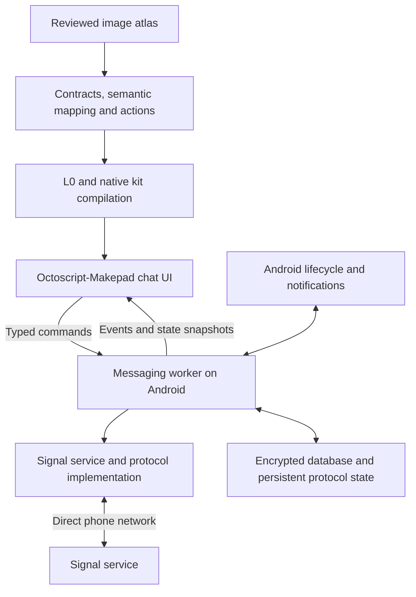

Signal client through the Octoscript image-to-app flow

2026-09-16 · Source and documentation investigation. No Signal software was installed or built, no account was linked, and no messages were sent. Android interoperability, performance and security have not been established by this review.

Building the native interface is feasible with the existing pipeline. A client that exchanges messages with Signal users is also a credible engineering project, but needs a maintained Signal service implementation, durable protocol state and Android lifecycle work. Image conversion supplies none of those. Recommend an Android-first linked-device text-messaging experiment before committing to a complete messenger.

The follow-up [local Robrix2 widget assessment](robrix2-widget-reuse.md) identifies reusable chat components, their Matrix coupling, the Makepad revision boundary and the semantic compiler changes needed to integrate them into this pipeline.

The assumed target follows the Mail work: source under this repository's top-level `apps/`, the shared Octoscript-Makepad runtime, access through OctoSense-mobile, and direct phone networking without a Mac relay. An iOS-like design does not establish iOS deployment support.

| Deliverable | Assessment | Evidence still needed |
| --- | --- | --- |
| Signal-like chat UI with fictional conversations | High confidence | Reviewed atlas, native layout, input and scrolling tests |
| Link an existing account and exchange real one-to-one text | Feasible experiment, conditional | Android build of the selected backend, provisioning, send/receive and session persistence |
| Phone connects directly over Wi-Fi | Architecturally feasible | Device proof with no desktop companion or transport forwarding |
| Reliable receipt while locked or suspended | Significant additional work | Supported wake-up/connection strategy, battery and OS lifecycle tests |
| Groups, encrypted attachments and history transfer | Later increments | Explicit backend coverage and interoperability tests for each feature |
| Voice/video calls | Separate major subsystem | Calling transport, permissions, audio routing, video and lifecycle integration |
| Full official-client parity and equivalent security | Not established | Broad interoperability, recovery and independent security review |
| Entire linked product distributed as Apache-2.0-only | Not supported by the evaluated dependencies | A different licensing/distribution decision or separately obtained rights |

The existing implementation gives us useful proof. [Mail's native module](../apps/mail/native/src/lib.rs) already hosts AppCard scenes in the launcher; [scene binding](../apps/mail/native/src/scenes.rs) applies dynamic data through the native renderer; [device workers](../apps/mail/native/src/device.rs) keep networking off the UI thread. [The Android receipt](../apps/mail/evidence/android-standalone-20260916/result.json) records real device networking and a 150-message list with only 60 rendered rows. These are Mail results, not Signal protocol or background-delivery results. Its broader launcher suite also records two failures, so this is not a claim that the entire platform is green.

The inspected consumer revisions were AppCards `2c070cb` and OctoSense-mobile `45dbbfb`. Both select Octoscript-Makepad `b1596d9c2cee6e80cca9d27b1b0c2d57b9d28dd8`, which owns the underlying Makepad and Octoscript pins. The investigation also read the current, locally edited pipeline instructions; those existing edits were not changed.

Signal now supports linking another Android phone or tablet to an existing primary device; the official announcement was published on August 4, 2026. This makes linked-device onboarding a better first target than replacing the primary registration. Official support currently specifies five linked devices, primary-device activity at least every 30 days, and unlinking after 45 days of linked-device inactivity. These are service constraints, not evidence that a third-party library implements every current feature. Initial linking still requires the user's primary device; independent phone networking does not mean an account with no primary device. [Announcement](https://signal.org/blog/linked-devices-and-android-tablets/), [linked-device support](https://support.signal.org/hc/en-us/articles/360007320551-Linked-Devices)

| Backend option | What the source establishes | Fit for this project |
| --- | --- | --- |
| `libsignal` directly | Rust implementations with Java, Swift and TypeScript interfaces; outside use is unsupported and interfaces can change | Useful core dependency, not a complete supported third-party messenger SDK. We would still own application/service integration and storage. |
| Presage + `libsignal-service-rs` | Rust client library advertising account linking, contacts, groups, messaging, attachments and SQLite storage | Preferred candidate for a bounded Rust integration experiment. Android compilation and current server interoperability remain untested here. |
| Signal-Android service code through Kotlin/JNI | A real Java/Kotlin service module, with dependencies on other Signal core modules | Fallback if the Rust path fails. Considerably more Gradle, JNI, lifecycle and maintenance integration than dropping in one library. |
| `signal-cli` JSON-RPC | Existing desktop/server registration, linking and messaging interface | Useful optional desktop diagnostic reference. A Mac-hosted daemon fails the required independent-phone architecture; its desktop binaries are not an Android embedding solution. |

These distinctions come from [libsignal's README](https://github.com/signalapp/libsignal), [Presage's README](https://github.com/whisperfish/presage), [Signal-Android's service build](https://github.com/signalapp/Signal-Android/blob/main/lib/libsignal-service/build.gradle.kts), and [signal-cli's README](https://github.com/AsamK/signal-cli). Presage currently documents a BoringSSL/OpenSSL conflict when combining contact discovery with its SQLCipher path, with a proposed alternate SQLite encryption provider. The first experiment should avoid contact discovery and prove storage plus direct messaging first. This is a dependency risk to investigate, not proof that Android compilation will fail.

Do not use a fresh registration of the user's existing number as an innocuous test: signal-cli explicitly documents that registration can unregister the existing client. Its maintainers also warn that versions older than three months may fail as the service changes. Pin a tested backend revision and budget ongoing update/interoperability work. [signal-cli lifecycle and usage](https://github.com/AsamK/signal-cli)

Upstream commit metadata observed during this review, for a reproducible follow-up investigation rather than validated dependency pins:

| Repository | Observed HEAD |
| --- | --- |
| signalapp/libsignal | `91abf5000783cbc131701ea20bafd5f8f8158720` |
| signalapp/Signal-Android | `d555580a46eb5a28a042e6a10fa91431fbb3d746` |
| whisperfish/presage | `3a45e915520348cbd93fc13de47c482b8e855c99` |
| AsamK/signal-cli | `a255a7fecfe80452fde83c1709086fcbf900716a` |

The proposed runtime has a small typed boundary between the native interface and a long-lived messaging worker:



Use commands such as `begin_link`, `open_conversation`, `send_text`, `load_older`, `mark_read` and `unlink`, with account, conversation and operation identifiers. These are proposed internal commands, not claimed upstream API names. Persist an outgoing operation before sending; reconcile ambiguous outcomes instead of promising automatic exactly-once delivery. Apply protocol/session updates and message persistence using the backend's transactional requirements. A normal UI JSON cache is not an adequate replacement for cryptographic session storage.

Reuse Mail's worker ownership and native action mapping, but replace its synchronous polling-oriented service with an asynchronous message/event runtime. Do not run network work or database operations on the UI thread. For direct in-process hosting, bounded queues are preferable to copying Mail's loopback HTTP transport. The launcher and every other component in that process would share the trust boundary with message plaintext and keys: an `AppModule` is not an Android security sandbox.

For stronger isolation, evaluate a separate Android APK with its own app UID, launched from OctoSense-mobile, while keeping its source under `apps/signal/`. An independently packaged backend could expose narrow, authenticated IPC, but process separation alone does not establish a license exception or eliminate plaintext exposure in a shared UI. Choose the packaging after the license and threat-boundary review; do not silently link an AGPL backend into the Apache-labelled launcher.

Protect an encrypted database key with Android Keystore where supported, and store protocol secrets only inside private app storage. This is a wrapping-key design: it does not assume every Signal key algorithm can execute inside secure hardware. Validate hardware support and restart/unlock behavior on the actual phone. Keep keys, provisioning material and live chats out of atlas prompts, cards used as fixtures, logs and capture files. [Android Keystore](https://developer.android.com/privacy-and-security/keystore)

The inspected launcher manifest includes internet and notification permissions, and Makepad supplies a basic notification call. It does not declare a Signal receive service or push receiver. A background thread tied to a visible widget cannot establish locked-screen delivery. Investigate a service-compatible push/connection strategy and Android lifecycle handling; simply adding a generic FCM receiver does not establish that Signal's service can deliver to it. WorkManager is not a substitute for a continuously available realtime messaging channel. Test normal suspension, network changes and process death separately from explicit user force-stop. [Android background restrictions](https://developer.android.com/develop/background-work/background-tasks/bg-work-restrictions)

The image-to-app work would use the existing [flow](../lab/image-to-appcard-flow/README.md) and [native instrument procedure](../lab/core/NATIVE-INSTRUMENT.md):

1. Author an 8–10-state fictional atlas: link device, conversation list, one-to-one thread, composer/reply, search, attachment preview, identity-change/safety-number state, settings, offline/retry, and an optional new-message App Card. Use our own product identity; mark later capabilities explicitly.
2. Preserve the prompt, original output bytes, actual resolution and crop provenance. Run `intake,prepare`, author the native contracts, then `observe,measure,map` and review the result. The runner records image-generation provenance; it does not itself generate a usable app or infer service behavior from pixels.
3. Author `contract.json`, `mapped.json`, `semantic-map.json` and `service-actions.json` for each scene. Run `semantic,compile,bundle,service-test`; use `extract` only for a declared reusable App Card. All applications remain under `apps/`; pipeline tooling stays under `lab/`.
4. Implement native chat rows, timestamps, receipts and composer controls against fixture events. Preserve scroll position when older rows are prepended and when incoming messages arrive. Mail's fixed-height rows are only a starting point: variable-height bubbles, emoji/CJK text, selection and keyboard resizing need new layout/interaction proof.
5. Bind the validated messaging adapter. Native text is sufficient for message bodies; Mail's HTML WebView is not a prerequisite. Image generation stays in design authoring, never on the send/receive path.
6. On macOS, test an owned release instance with the built-in Makepad instrument and native GPU. On Android, use measured widget bounds, actual touch input and app-owned GPU capture, following the existing Android exception because the pinned HTTP instrument is compiled out there. Keep Studio-backed `capture/gate` explicitly unrun. Record fixtures only and verify live traffic through counts and protocol outcomes.

Proposed source layout, not a scaffold created by this investigation:

```text
Octosense-Service-AppCards/apps/signal/
  image-to-appcard-flow.json
  source/                  # prompt and generation provenance
  cards/                   # reviewed scene contracts and mappings
  assets/                  # declared design assets
  native/                  # Octoscript-Makepad UI and typed domain boundary
  service/                 # fixture reducer and invariants
  scripts/                 # authoring and owned native verification
  evidence/                # fictional captures and counts-only results
```

Backend placement and release licensing remain a design decision; this tree is not permission to copy AGPL code into an Apache-only distribution.

The previous Apache-2.0 requirement materially affects implementation. `libsignal` and Signal-Android are AGPLv3; Presage declares `AGPL-3.0-only`; signal-cli declares GPLv3. Our independently written UI/framework code can retain its own Apache notices, but we cannot relabel those dependencies Apache or assume a combined linked APK can be distributed solely under Apache. In-process launcher integration could broaden the combined work that must comply. Determine the exact distribution obligations before that integration. [libsignal license, sections 5–6](https://github.com/signalapp/libsignal/blob/main/LICENSE), [Signal-Android license](https://github.com/signalapp/Signal-Android#license), [Presage manifest](https://github.com/whisperfish/presage/blob/master/presage/Cargo.toml), [Apache's compatibility explanation](https://www.apache.org/licenses/GPL-compatibility)

If an Apache-only combined product remains mandatory, the evaluated backends do not satisfy that condition. An original UI with fixture data is still possible; a separate service boundary requires specific review and is not an automatic workaround. Use distinct branding for a public client rather than presenting it as the official Signal app. [Signal's open-source and brand guidance](https://signal.org/brand/)

The smallest useful real-network milestone is linked-device provisioning, one-to-one text send/receive, a conversation list, local search, durable history, accurate send/delivery states and visible connection errors. Add identity-change handling before calling it a usable secure messenger. Treat background notifications as a separate acceptance gate. Defer primary-account registration, full history migration, group administration, calls, stories, payments and backup/restore. Voice/video involves Signal's separate RingRTC/WebRTC stack and is not unlocked by making a call-screen card. [RingRTC](https://github.com/signalapp/ringrtc)

Advance through these gates:

| Gate | Required evidence | Decision if it fails |
| --- | --- | --- |
| Dependency and distribution | Accepted license scope; pinned dependency graph; successful Android ARM64 build without changing the shared UI runtime arbitrarily | Reassess backend or packaging; keep UI fixtures separate |
| Protocol proof | User-authorized test account linked, bidirectional text with official clients, session reload, unlink/relink and offline recovery | Do not claim real Signal support from a successful UI demo |
| Native experience | Long variable-height threads, prepend anchoring, search, composer/IME, receipt updates, keyboard and orientation tests | Fix layout/state handling before adding more screens |
| Delivery and storage | Locked-screen receipt, supported wake-up path, restart recovery, encrypted-store checks, duplicate/ambiguous-send handling | Label the result foreground-only; do not present it as a daily messenger |
| Expansion | Verified group, media and privacy semantics for each enabled feature | Hide unsupported actions instead of simulating success |

Allow a bounded initial build/link/send/receive investigation before estimating the complete schedule. UI-only estimates would materially understate backend maintenance, background delivery and security work. The recommendation is to proceed with that experiment once the distribution choice is settled, while retaining a fixture adapter so the design pipeline can progress independently.
