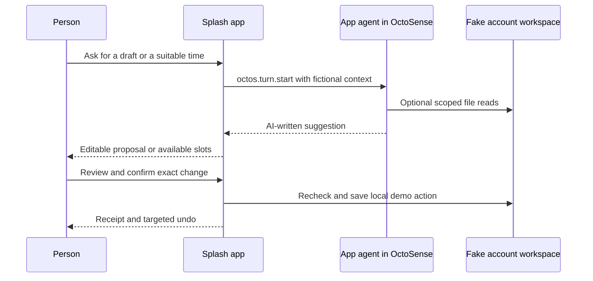

# Two agentic apps for hackathon contestants

English | [简体中文](README.zh-CN.md)

For cards **authored by DeepSeek through App Studio**, use the separate
[DeepSeek Studio examples](deepseek-studio/README.md). They include L0 glance
cards, interactive apps, generation records and independent validation. The
two original apps below were authored by Codex and use DeepSeek at runtime.

Start with a small, reviewable loop: **read the source → ask the app agent →
review a proposal → confirm a local action → inspect its receipt**. These two
contained Splash apps use fictional email/calendar data and the real
`octos.turn.start` integration. Their offline fallbacks are labeled explicitly.
No email, invitation or calendar update reaches a real account.

| Reference | Try it | What to learn |
| --- | --- | --- |
| [Email Action](email-action/BRIEF.md) | Open Maya's email, ask for a draft, edit it, review the recipient and confirm demo delivery. Open Jordan's message to see the scheduling request. | Grounded suggestions, human review, message identity, editable drafts, one delivery per message and targeted undo. |
| [Meeting Planner](meeting-planner/BRIEF.md) | Ask which 30-minute slot works for Alex, Maya and Jordan. Choose a time, review the invitation, simulate a late conflict, then try another time. | Model recommendations plus deterministic interval checks, confirmation against current data, duplicate prevention and a durable receipt. |


## Run the desktop references

First complete the repository's [setup](../../docs/QUICKSTART.md#1-prerequisites)
and run `tools/octo doctor`. From the repository root:

```sh
tools/octo run examples/agentic-hackathon/email-action/bundle --hidden --detach --port 8471
tools/octo run examples/agentic-hackathon/meeting-planner/bundle --hidden --detach --port 8472
```

Omit `--hidden` to try the apps visibly yourself. The hidden commands were
executed on macOS using the native Metal renderer. Each instance owns its
state under the corresponding example's ignored `.local-state/` directory.
Close only the instances you launched:

```sh
curl --fail http://127.0.0.1:8471/quit
curl --fail http://127.0.0.1:8472/quit
```

`card-host` has no agent service. Pressing **Ask app agent** there shows an
explicit unavailable result; it is not a failed provider call and does not
prove live agent operation. Use **Use sample reply / offline** or **Find first
free time / offline** to finish the walkthrough locally.

To use a real agent, run the same bundles in an OctoSense shell with a
configured provider and allow each app's agent. The app uses the person's
provider settings without receiving credentials. See the [shell integration
path](../../docs/PUBLISHING.md#4-rehearse-the-store-path-locally) and
[agent service contract](../../docs/AI-SERVICES.md#the-assistant-capabilities).
DeepSeek V4 Flash has been exercised in both the desktop shell and an isolated
OnePlus 6 package. See the [phone setup and walkthrough](ANDROID.md) and
[live evidence](validation/LIVE-SHELL.md). On the
reviewed Android build, App Studio accepts storage-only previews: it cannot
run these agent-capable manifests. Use the normal catalog/app hosting path,
not a modified manifest presented as equivalent coverage.

## A five-minute walkthrough

**Email Action**

1. The needs-action inbox hides the automated newsletter. **Show all messages**
   still lets the person open it; the app does not erase low-priority mail.
2. Open **Maya Chen**, read the original request and its written example
   explanation. **Ask agent to draft** requests a real app-agent turn. In the
   standalone host use the clearly labeled sample reply instead.
3. Edit the reply. **Review reply** shows the exact recipient and text;
   **Confirm demo delivery** appends one record to the local outbox. The model
   has no send tool. A repeat attempt cannot add a duplicate.
4. Change the draft after delivery and view its receipt: the receipt still
   shows the delivered text. **Undo demo delivery** removes only that message's
   outbox record and keeps its draft.
5. Open **Jordan Lee**, then **Agent**. Ask what facts are missing before
   promising a meeting time. The agent can read its account workspace; the
   fake scheduling request also has a companion scenario in Meeting Planner.

**Meeting Planner**

1. The scenario is fixed at Monday, **5 October 2026, UTC**. Maya is busy at
   10:00; Alex at 11:00; Jordan at 13:00. Candidate meetings last 30 minutes.
2. Ask the agent to recommend a listed free time and explain the conflicts.
   Offline calculation chooses 14:00 initially. These are distinct paths.
3. Review 14:00, press **Simulate calendar change**, then confirm. Jordan's new
   conflict means the app refuses the stale proposal without creating an event.
4. Recalculate and choose 15:30. Confirm the exact date/time/attendees; inspect
   the local receipt. Restart and it remains. Undo keeps the original busy events.
5. **Simulate fully booked day** produces an honest no-slot result. No model
   response can override the app's overlap test.

## Trace the code

| Responsibility | Email Action | Meeting Planner |
| --- | --- | --- |
| App and UI | [main.splash](email-action/bundle/main.splash) | [main.splash](meeting-planner/bundle/main.splash) |
| Requested capabilities | [manifest.json](email-action/bundle/manifest.json) | [manifest.json](meeting-planner/bundle/manifest.json) |
| Agent contract | [AGENT.md](email-action/bundle/AGENT.md) | [AGENT.md](meeting-planner/bundle/AGENT.md) |
| Native regression driver | [verify_native.py](scripts/verify_native.py), function `email` | Same driver, function `meeting` |

Read `boot` → `save` → `ask` → `review` → `deliver`/`confirm` → `undo`.
`save` puts fixtures and state under `accounts/device/`, the account workspace
the shell's app peer can read. Data at the jail root would not be equivalent.
The agent receives a bounded question/context, and its answer is plain text.
It cannot replace the app's action handlers or choose an arbitrary recipient.
The app calls no Mail, Calendar or external network service.



The reviewed shell does not install bundle `AGENT.md` instructions into peers,
so each request repeats the operative rules. The declared file is a documented
contract, not proof of runtime installation. These samples do not claim custom
script-agent tools, automatic background triggers, cross-app delegation or
notification/glance publication. The system agent can route to an allowed app
peer in a shell, but the standalone test does not exercise that route.

## Validate your fork

```sh
python3 -B examples/agentic-hackathon/scripts/verify_native.py
tools/octo check examples/agentic-hackathon/email-action/bundle
tools/octo check examples/agentic-hackathon/meeting-planner/bundle
```

The native driver launches isolated hidden instances, derives targets from
current widget bounds, scrolls before clicking, injects real input, checks
stored results and relaunches to test persistence. It saves source hashes,
inputs, failures and native logs under ignored `build/<timestamp>/`, and
refreshes real screenshots in each bundle. Inspect those images after running;
assertions alone cannot prove legibility. `OCTO_HUB`, `OCTO_CARD_HOST` and
`OCTOSENSE_APP_HUB` can select an already prepared runtime as in the quickstart.

**Current evidence:** [51/51 desktop native checks passed](validation/README.md) with App Hub `927f2fe`,
Makepad `c155f61d`, Octoscript-Makepad `2cc5ef37`, in a release build. This covers
local behavior and the agent-unavailable path. Separate live checks verified
DeepSeek responses, Android app-agent consent and scoped file reads, reviewed
local email delivery, stale-calendar rejection and a confirmed alternative.
The Android evidence records the initial automated cold-launch failure and
the working App Hub launch path. Publisher identity
and support/privacy URLs still need the contestant's own details; these
unsigned references are not store submissions.

Use the [model validation guide](../../docs/MODEL-VALIDATION.md) when extending
these apps: start with one complete action, return precise failures to the
coding model, inspect pixels and state, and rerun against the final source.
The Mail [action-card plan](https://github.com/OctoSense-org/OctoSense/blob/ccf8013f2bd7adbb6c20d5f52f47bcfbcbb55313/apps/mail/docs/2026-10-01-email-action-card-plan.md)
informed the review/approval sequence; its planned background features are
not implemented by these examples. The existing [Calendar reference](../calendar/README.md)
informed conflict and undo behavior; its sync server is a separate project.
