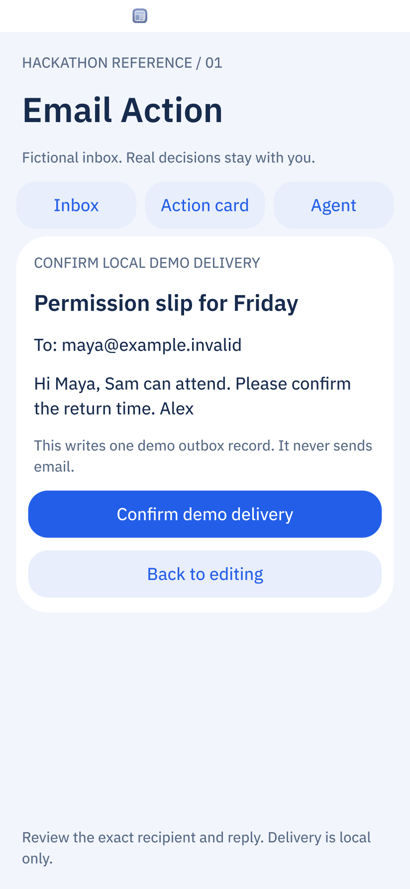
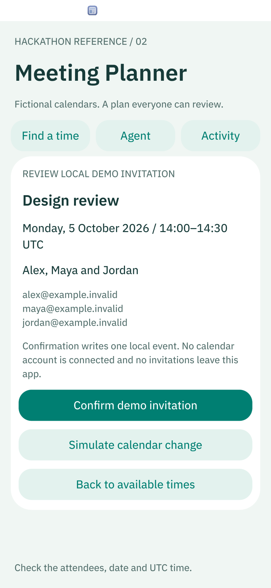
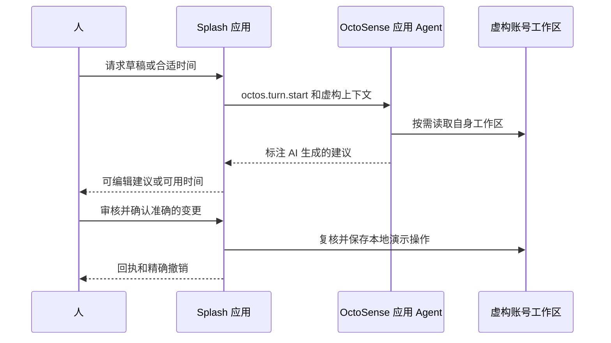

# 面向黑客松参赛者的两个 Agent 应用

[English](README.md) | 简体中文

从一条可审查的路径开始：**读原始数据 → 问应用 Agent → 审核建议 → 确认本地操作 → 查看回执**。
这两个 Splash 应用使用虚构邮件/日历，接入真实的 `octos.turn.start`，并明确标注离线替代路径。
不会向真实账号发送邮件、邀请或日历更新。

| 示例 | 操作 | 学到什么 |
| --- | --- | --- |
| [Email Action](email-action/BRIEF.md) | 打开 Maya 的邮件，请 Agent 起草，编辑正文，核对收件人，再确认演示投递。Jordan 的邮件是安排会议的请求。 | 有依据的建议、人工审核、记录身份、草稿编辑、防重复和精确撤销。 |
| [Meeting Planner](meeting-planner/BRIEF.md) | 请 Agent 为 Alex、Maya、Jordan 找半小时空档。审核邀请时模拟新增冲突，再选择其他时间。 | 模型建议加确定性的时间检查、确认时复核、幂等操作及持久回执。 |





## 在桌面运行

先完成仓库的[环境准备](../../docs/QUICKSTART.md#1-prerequisites)，运行 `tools/octo doctor`。
以下命令从仓库根目录执行，已在 macOS 的原生 Metal 渲染器上运行：

```sh
tools/octo run examples/agentic-hackathon/email-action/bundle --hidden --detach --port 8471
tools/octo run examples/agentic-hackathon/meeting-planner/bundle --hidden --detach --port 8472
```

自己操作时去掉 `--hidden`。状态保存在各示例被忽略的 `.local-state/` 中。
只关闭自己启动的实例：

```sh
curl --fail http://127.0.0.1:8471/quit
curl --fail http://127.0.0.1:8472/quit
```

`card-host` 没有 Agent 服务。在那里点击 **Ask app agent** 会明确显示服务不可用；
这既不是一次提供商失败调用，也不能证明真实 Agent 已运行。
使用 **Use sample reply / offline** 或 **Find first free time / offline** 可以完成离线路径。

真实 Agent 需要将同一 bundle 运行在已配置模型的 OctoSense Shell 中，并允许该应用的 Agent。
应用使用宿主的提供商配置，接触不到凭据。参见[本地 Shell 安装路径](../../docs/PUBLISHING.md#4-rehearse-the-store-path-locally)
和 [Agent API](../../docs/AI-SERVICES.md#the-assistant-capabilities)。真实模型与 Android 的验证单独记录。
已审查的 Android App Studio 只接纳 storage-only 预览，不能运行这些带 Agent 权限的 manifest；
应使用正常的目录安装/应用宿主路径，不应删掉权限后声称得到了等价验证。

## 五分钟演示

**Email Action**

1. 待处理列表不显示自动简报；**Show all messages** 仍然能打开它，没有删除低优先级邮件。
2. 打开 **Maya Chen**，阅读原始请求和标明为书面示例的说明。**Ask agent to draft** 发起真实 Agent 请求；
   独立宿主中可改用标明离线的样例回复。
3. 编辑回复，**Review reply** 核对准确的收件人和正文；**Confirm demo delivery** 只在本地演示发件箱新增一条记录。
   模型没有发送工具，重复确认也不会新增第二条。
4. 投递后修改草稿，再看回执：回执仍显示实际投递的正文。**Undo demo delivery** 只撤销该邮件的记录，保留草稿。
5. 打开 **Jordan Lee → Agent**，询问承诺会议时间前缺什么信息。Agent 可读自身账号工作区；
   Meeting Planner 提供对应的虚构排期场景。

**Meeting Planner**

1. 场景固定为 **2026 年 10 月 5 日星期一，UTC**。Maya 在 10:00 忙，Alex 在 11:00 忙，Jordan 在 13:00 忙。
   候选会议均为 30 分钟。
2. 请 Agent 推荐列表中的空档并解释冲突。离线计算初始推荐 14:00，两条路径明确区分。
3. 审核 14:00 的邀请时，点击 **Simulate calendar change**，再确认。Jordan 新增冲突后，应用拒绝过时建议，不创建事件。
4. 重新计算并选择 15:30，确认日期、时区和人员。查看回执，重启后依然存在；撤销不删除原有忙碌事件。
5. **Simulate fully booked day** 展示无共同空档的状态。模型不能绕过应用的区间重叠检查。

## 阅读代码

| 职责 | Email Action | Meeting Planner |
| --- | --- | --- |
| 应用与界面 | [main.splash](email-action/bundle/main.splash) | [main.splash](meeting-planner/bundle/main.splash) |
| 申请权限 | [manifest.json](email-action/bundle/manifest.json) | [manifest.json](meeting-planner/bundle/manifest.json) |
| Agent 约定 | [AGENT.md](email-action/bundle/AGENT.md) | [AGENT.md](meeting-planner/bundle/AGENT.md) |
| 原生验证 | [verify_native.py](scripts/verify_native.py) 的 `email` | 同一脚本的 `meeting` |

依次读 `boot` → `save` → `ask` → `review` → `deliver`/`confirm` → `undo`。
`save` 把虚构数据及状态写入 `accounts/device/`，这是 Shell 中应用 Agent 能读取的账号工作区；
写在 jail 根目录不等价。Agent 回答是普通文本，不能替换操作处理器或任意改收件人。
应用不调用 Mail、Calendar 或外部网络服务。



已审查的 Shell 尚不安装 bundle 的 `AGENT.md`，因此每次请求都会带上实际规则。
声明该文件是在记录约定，不证明运行时加载了它。这两个示例不声称已实现自定义脚本 Agent 工具、
自动后台触发、跨应用委派、通知或概览发布。Shell 的系统 Agent 可路由到已允许的应用 Agent，
但独立宿主测试没有覆盖该路径。

## 验证自己的修改

```sh
python3 -B examples/agentic-hackathon/scripts/verify_native.py
tools/octo check examples/agentic-hackathon/email-action/bundle
tools/octo check examples/agentic-hackathon/meeting-planner/bundle
```

原生脚本创建隔离的隐藏实例，从当前控件边界定位，必要时先滚动，再注入真实输入，
检查存储结果并重启验证持久化。源码哈希、输入、失败和日志保存在忽略的 `build/<时间>/` 中，
并更新 bundle 里的真实截图。运行后仍要打开截图审查，断言本身不能证明文字可读。
可按快速上手文档通过 `OCTO_HUB`、`OCTO_CARD_HOST` 和 `OCTOSENSE_APP_HUB` 选择已准备的运行时。

**当前证据：** App Hub `927f2fe`、Makepad `c155f61d`、Octoscript-Makepad `2cc5ef37` 的 release 构建，
桌面原生检查 [**51/51** 通过](validation/README.md)，覆盖本地行为和 Agent 不可用路径。
真实模型回答、Shell Agent 文件读取和 Android 是单独的待验证项。
发布者身份、支持及隐私网址需参赛者自行填写；未签名示例不是商店提交。

扩展示例时遵循[模型验证指南](../../docs/MODEL-VALIDATION.zh-CN.md)：先完成一条完整路径，
把精确失败交回编码模型，同时检查像素与状态，再用最终源码复测。
Mail 的[操作卡片计划](https://github.com/OctoSense-org/OctoSense/blob/ccf8013f2bd7adbb6c20d5f52f47bcfbcbb55313/apps/mail/docs/2026-10-01-email-action-card-plan.md)
提供审核顺序参考，其规划中的后台能力不属于本示例。
既有 [Calendar 示例](../calendar/README.zh-CN.md)提供冲突与撤销参考，其同步服务仍是独立项目。
